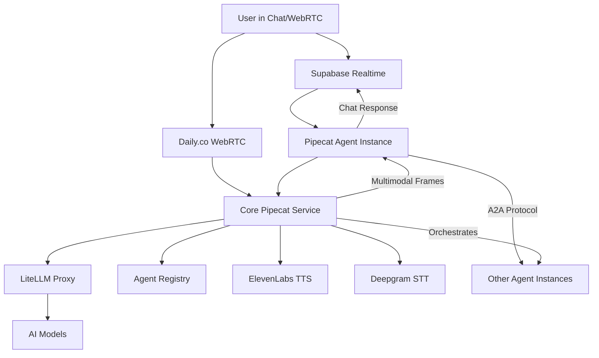

# PMOVES Pipecat Architecture

## Overview

The PMOVES Pipecat system follows a **core service + agent instances** architecture with full **multimodal capabilities**, **WebRTC integration**, and **Supabase Realtime chat integration** as outlined in the masterplan.

## Architecture Components

### 1. Core Pipecat Service (`pmoves-pipecat`)
**Purpose**: Central communication layer and orchestrator with full multimodal capabilities
- **Port**: 8080 (API), 8081 (WebSocket)
- **Container**: `pmoves-pipecat`
- **Responsibilities**:
  - LiteLLM integration for model serving
  - Agent registry integration with enhanced metadata
  - A2A protocol support for agent-to-agent communication
  - Dynamic agent spawning/orchestration
  - WebSocket communication hub
  - **WebRTC support** via Daily.co integration
  - **Multimodal pipelines** (text, audio, video, images)
  - **Supabase Realtime integration** for chat
  - **TTS/STT services** (ElevenLabs, Deepgram)

### 2. Agent Instances (`pmoves-pipecat-agent`)
**Purpose**: Lightweight agent clients with multimodal capabilities
- **Port**: 8000 (configurable)
- **Container**: `pmoves-pipecat-agent` (example: Supabase agent)
- **Responsibilities**:
  - Connect to core pipecat service via WebSocket or WebRTC
  - Handle specific agent types (Supabase, Transcribe, etc.)
  - Chat integration via Supabase Realtime
  - Agent-specific command processing
  - Multimodal frame processing (text, audio, video, images)

## Communication Flow



## Key Features

### Multimodal Capabilities
- **Text Processing**: LLM integration via LiteLLM proxy
- **Audio Processing**: TTS (ElevenLabs) and STT (Deepgram) services
- **Video Processing**: WebRTC streams via Daily.co
- **Image Processing**: Image frame support in pipelines
- **Frame Types**: TextFrame, AudioFrame, VideoFrame, ImageFrame, LLMMessagesFrame

### WebRTC Integration
- **Daily.co Transport**: Real-time audio/video communication
- **Room Management**: Dynamic room creation and management
- **Bot Integration**: Agents can join WebRTC calls as participants
- **Multimodal Streams**: Audio, video, and data channels

### Supabase Realtime Chat Integration
- **Real-time Messaging**: Live chat via Supabase Realtime
- **Agent Summoning**: Call agents with `@AgentName` syntax
- **Message Routing**: Automatic routing to appropriate agents
- **Response Handling**: Agents respond with avatars and capabilities
- **Channel Management**: Multiple chat channels supported

### Enhanced Agent Registry Integration
- **Capability Detection**: Dynamic capability detection based on available services
- **Multimodal Metadata**: Transport types, supported modalities
- **Real-time Status**: Live agent status and health monitoring
- **A2A Protocol**: Agent discovery and inter-agent messaging

### Dynamic Agent Spawning
- **On-demand Creation**: Spawn agents based on requirements
- **Capability-based**: Agents created with specific capabilities
- **Transport Selection**: WebSocket or WebRTC transport
- **Pipeline Configuration**: Custom pipelines per agent type

## Environment Configuration

### Core Service Environment Variables
```bash
# Core service
PIPECAT_SERVICE_PORT=8080
PIPECAT_WEBSOCKET_PORT=8081
LITELLM_PROXY_URL=http://litellm-proxy:4000
AGENT_REGISTRY_URL=http://backend:8000/agents
MAX_AGENTS=10

# Multimodal capabilities
DAILY_API_KEY=your_daily_api_key
ELEVENLABS_API_KEY=your_elevenlabs_api_key
DEEPGRAM_API_KEY=your_deepgram_api_key
OPENAI_API_KEY=your_openai_api_key

# Supabase integration
SUPABASE_URL=https://your-project.supabase.co
SUPABASE_KEY=your_supabase_anon_key
```

### Agent Instance Environment Variables
```bash
AGENT_TYPE=supabase
AGENT_NAME=SupabaseAgent
CALL_WORD=@SupabaseAgent
CHAT_CHANNEL=main-room
AVATAR_URL=https://example.com/supabase-agent-avatar.png
PIPECAT_SERVICE_URL=http://pipecat:8080
PIPECAT_WS_URL=ws://pipecat:8081
```

## Agent Types and Capabilities

### Supabase Agent
- **Base Capabilities**: text, chat, database, search, upsert
- **Multimodal**: +tts, +stt, +webrtc (if API keys provided)
- **Commands**: `search`, `create table`, `upsert`
- **Integration**: Direct Supabase client access + Realtime chat

### Transcribe Agent
- **Base Capabilities**: text, chat, transcription, media_processing
- **Multimodal**: +tts, +stt, +webrtc, +audio, +video
- **Commands**: `transcribe <url>`, `process audio`, `process video`
- **Integration**: Audio/video processing services

### Multimodal Agent
- **Base Capabilities**: text, chat, vision, image_generation, audio_processing
- **Multimodal**: +tts, +stt, +webrtc, +audio, +video, +image
- **Commands**: `analyze image`, `generate image`, `process audio`
- **Integration**: Vision models, image generation, audio processing

## API Endpoints

### Core Service (`pmoves-pipecat`)
- `GET /health` - Service health with multimodal capability status
- `GET /agents` - List active agents with capabilities
- `POST /agents/spawn` - Spawn new agent instance with config
- `DELETE /agents/{agent_id}` - Stop agent instance
- `GET /models` - List available LiteLLM models
- `POST /chat/send` - Send message to chat channel
- `WS /ws/{agent_id}` - WebSocket for agent communication (supports multimodal frames)
- `GET /a2a/discover` - A2A agent discovery with multimodal info
- `POST /a2a/message/{agent_id}` - A2A messaging with response

### Agent Instance (`pmoves-pipecat-agent`)
- `GET /health` - Agent health, status, and capabilities
- `GET /config` - Agent configuration and settings

## WebSocket Frame Protocol

### Supported Frame Types
```json
{
  "type": "text",
  "text": "Hello, agent!"
}

{
  "type": "audio",
  "audio": "base64_encoded_audio_data"
}

{
  "type": "image", 
  "image": "base64_encoded_image_data"
}

{
  "type": "video",
  "video": "base64_encoded_video_data"
}
```

### Response Format
```json
{
  "type": "text",
  "agent_id": "supabase_1",
  "data": "Agent response text"
}
```

## Deployment

### Using Docker Compose
```bash
# Build and start core service
docker-compose up pipecat

# Start agent instances
docker-compose up pipecat-agent

# Or start everything
docker-compose up
```

### Health Checks
- Core Service: `http://localhost:8080/health`
- Agent Instance: `http://localhost:8001/health`

### Health Response Example
```json
{
  "status": "healthy",
  "service": "pmoves-pipecat-core",
  "agents_count": 2,
  "max_agents": 10,
  "litellm_available": true,
  "supabase_available": true,
  "realtime_available": true,
  "a2a_available": false,
  "webrtc_available": true,
  "multimodal_capabilities": {
    "tts": true,
    "stt": true,
    "webrtc": true
  }
}
```

## Integration Examples

### Chat Integration
1. User sends message: `@SupabaseAgent search for climate data`
2. Supabase Realtime delivers message to core service
3. Core service routes to SupabaseAgent
4. Agent processes command and searches database
5. Agent responds via Supabase Realtime with results
6. Response appears in chat with agent avatar

### WebRTC Integration
1. User joins Daily.co room
2. Agent spawned with WebRTC transport
3. Agent joins same room as bot participant
4. Real-time audio/video communication
5. Multimodal processing (speech-to-text, text-to-speech)
6. Agent responds with voice and can share screen/video

### A2A Protocol
1. SupabaseAgent needs transcription service
2. Sends A2A message to TranscribeAgent
3. TranscribeAgent processes audio/video
4. Returns transcription via A2A protocol
5. SupabaseAgent stores results in database
6. Collaborative workflow completed

## Next Steps

1. **Complete Pipeline Implementation**
   - Implement full Pipecat pipeline creation
   - Add custom LiteLLM service for Pipecat
   - Enhance frame processing logic

2. **WebRTC Enhancement**
   - Add room management API
   - Implement screen sharing
   - Add video processing capabilities

3. **Agent Registry Enhancement**
   - Add capability-based agent discovery
   - Implement agent health monitoring
   - Add performance metrics

4. **Production Features**
   - Add authentication and authorization
   - Implement rate limiting
   - Add comprehensive logging and monitoring
   - Scale for production workloads 