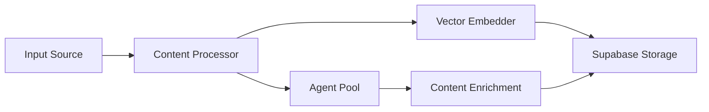
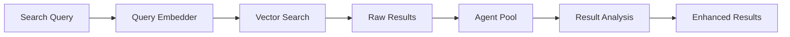

# PMOVES Architecture Specification

## System Architecture

### 1. Core Service Layer
```
PMOVES/
├── Services/
│   ├── TranscriptionService/        # Handles all transcription operations
│   │   ├── LocalProcessor/         # GPU-based processing
│   │   ├── CloudProcessor/         # Groq API integration
│   │   └── OutputFormatter/        # Handles various output formats
│   │
│   ├── ContentService/             # Content fetching and processing
│   │   ├── JinAIFetcher/          # Web content fetching
│   │   ├── MediaDownloader/        # yt-dlp integration
│   │   └── ContentProcessor/       # Content cleaning and formatting
│   │
│   ├── VectorService/             # Vector operations
│   │   ├── EmbeddingGenerator/    # OpenAI/Groq embeddings
│   │   ├── SearchEngine/          # Vector search implementation
│   │   └── AnalysisEngine/        # AI-powered analysis
│   │
│   └── AgentService/              # Future AI agent integration
│       ├── AgentManager/          # Agent lifecycle management
│       ├── AgentRegistry/         # Available agent capabilities
│       └── AgentOrchestrator/     # Agent coordination
```

### 2. Integration Layer
```
├── Integrations/
│   ├── OpenAI/                    # OpenAI API integration
│   ├── Groq/                      # Groq API integration
│   ├── JinAI/                    # JinAI integration
│   ├── Supabase/                 # Database operations
│   └── YTDLP/                    # Media download integration
```

### 3. Monitoring Layer
```
├── Monitoring/
│   ├── SSEMonitor/               # Real-time event monitoring
│   ├── PerformanceTracker/       # System performance
│   ├── ErrorTracker/             # Error logging and handling
│   └── MetricsCollector/         # Usage statistics
```

## Extension Points

### 1. AI Agent Integration
```python
class BaseAgent:
    """Base class for all AI agents"""
    def __init__(self):
        self.capabilities = []
        self.state = {}
        
    async def initialize(self):
        """Setup agent resources"""
        pass
        
    async def process(self, input_data: dict) -> dict:
        """Process input and return results"""
        pass
        
    async def cleanup(self):
        """Cleanup agent resources"""
        pass
```

### 2. Service Registration
```python
class ServiceRegistry:
    """Registry for dynamic service loading"""
    def register_service(self, service_type: str, implementation: object):
        pass
        
    def get_service(self, service_type: str) -> object:
        pass
```

### 3. Pipeline Extension
```python
class ProcessingPipeline:
    """Extensible processing pipeline"""
    def add_processor(self, processor: BaseProcessor):
        pass
        
    def remove_processor(self, processor_id: str):
        pass
```

## Data Flow Architecture

### 1. Content Processing Flow


### 2. Search Flow


## Agent Integration Guidelines

### 1. Agent Types
- **Content Processors**: Enhance content during ingestion
- **Search Enhancers**: Improve search results
- **Analysis Agents**: Provide deeper insights
- **Task Agents**: Handle specific operations

### 2. Agent Communication
```python
class AgentMessage:
    """Standard message format for agent communication"""
    def __init__(self):
        self.type: str
        self.content: dict
        self.metadata: dict
        self.priority: int
```

### 3. Agent Coordination
```python
class AgentOrchestrator:
    """Coordinates multiple agents"""
    async def dispatch_task(self, task: Task) -> list[Agent]:
        """Assign task to appropriate agents"""
        pass
        
    async def collect_results(self, agents: list[Agent]) -> dict:
        """Collect and combine agent results"""
        pass
```

## State Management

### 1. Service State
```python
class ServiceState:
    """Manages service state"""
    def save_state(self):
        pass
        
    def restore_state(self):
        pass
```

### 2. Agent State
```python
class AgentState:
    """Manages agent state"""
    def checkpoint(self):
        pass
        
    def rollback(self):
        pass
```

## Error Handling

### 1. Error Types
```python
class ServiceError(Exception):
    """Base class for service errors"""
    pass

class AgentError(Exception):
    """Base class for agent errors"""
    pass
```

### 2. Recovery Strategies
```python
class ErrorRecovery:
    """Implements recovery strategies"""
    async def handle_service_error(self, error: ServiceError):
        pass
        
    async def handle_agent_error(self, error: AgentError):
        pass
```

## Performance Considerations

### 1. Resource Management
```python
class ResourceManager:
    """Manages system resources"""
    def allocate_resources(self, requirements: dict):
        pass
        
    def release_resources(self, resource_id: str):
        pass
```

### 2. Load Balancing
```python
class LoadBalancer:
    """Balances workload across services"""
    def distribute_load(self, tasks: list[Task]):
        pass
```

## Security Framework

### 1. Authentication
```python
class AuthProvider:
    """Handles authentication"""
    async def authenticate(self, credentials: dict) -> bool:
        pass
```

### 2. Authorization
```python
class AccessControl:
    """Manages access control"""
    def check_permission(self, user: User, resource: str) -> bool:
        pass
```

## Monitoring and Metrics

### 1. Performance Metrics
```python
class MetricsCollector:
    """Collects system metrics"""
    def record_metric(self, metric: str, value: float):
        pass
```

### 2. Health Checks
```python
class HealthMonitor:
    """Monitors system health"""
    async def check_health(self) -> dict:
        pass
``` 