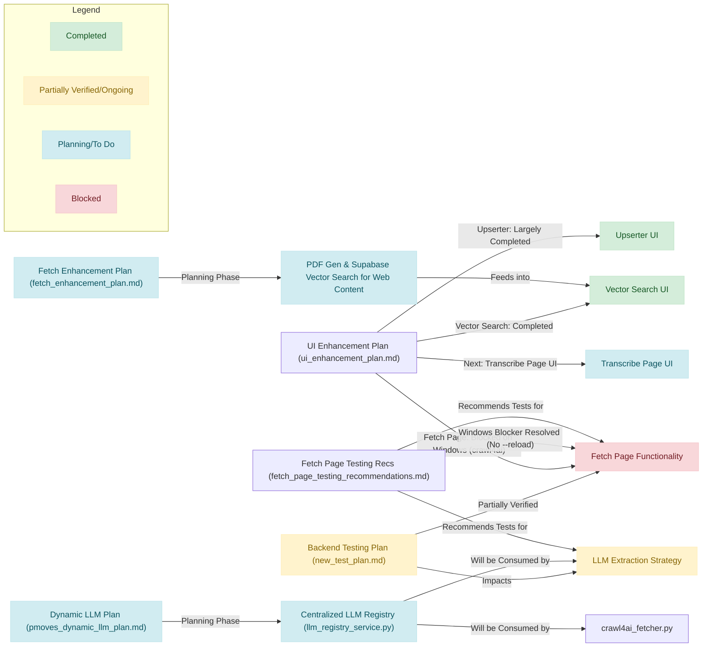

# Consolidated Overview of Planning Documents

This report summarizes the key features, objectives, explicitly mentioned statuses, and interdependencies found within the seven provided planning documents.

## Overall Status and Key Interdependencies Visualized

## Recent Developments and Next Steps

This section provides a high-level summary of recent significant accomplishments and outlines general next steps for the project, complementing the detailed statuses within individual planning documents.

### Key Accomplishments (as of 2025-05-11)

*   **`fetch_history` Bug Resolution:** The issue causing incorrect `failed` statuses in the `fetch_history` table (related to [`backend/app/main.py`](backend/app/main.py:1)) has been fixed. This ensures more accurate tracking and status reporting for content fetching operations.
*   **Comprehensive LLM Operations Logging & Structured Error Handling:** A robust system for logging LLM API calls and managing errors has been implemented. Key components include:
    *   A new `llm_call_logs` database table for detailed record-keeping of LLM interactions.
    *   The `log_llm_call` utility function, located in [`backend/app/utils/llm_logging.py`](backend/app/utils/llm_logging.py:1), to centralize logging logic.
    *   Successful integration of this logging and error handling mechanism into the `/fetch-content` endpoint, enhancing traceability and debugging for LLM-driven extraction processes.
*   **Backend Utility Modules Refactoring:** Significant refactoring of backend utility modules has been completed to improve code organization, maintainability, and resolve import-related issues. This involved restructuring code into the `backend/app/utils/` package and updating [`backend/app/general_utils.py`](backend/app/general_utils.py:1). This effort is documented in [`docs/refactoring_utility_modules.md`](docs/refactoring_utility_modules.md:1).
*   **Test Script Status Note:** During updates to testing procedures (documented in [`docs/livetest_instructions.md`](docs/livetest_instructions.md:1)), it was observed that the `LLMExtract_ValidRequestTokenInExtractionConfig_Google` test (and its alias `LLMExtract_ValidRequestTokenInExtractionConfig`) is currently commented out and therefore inactive within the [`live_llm_extraction_advanced_tester.py`](live_llm_extraction_advanced_tester.py:1) script.

### General Next Steps

*   **Continue Rigorous Live Testing:** Persist with the comprehensive live testing schedule detailed in [`docs/livetest_instructions.md`](docs/livetest_instructions.md:1). This is essential for validating recent fixes, particularly for `crawl4ai` integration and advanced LLM extraction features.
*   **Optimize Large Content Handling:** Evaluate and consider implementing more fundamental, long-term optimizations for processing very large web content. While timeout adjustments have provided some relief (as noted in [`docs/new_test_plan.md`](docs/new_test_plan.md:1) updates), architectural improvements could further enhance performance and reliability.
*   **Monitor and Refine LLM Logging:** Actively monitor the new LLM call logging system in operation. Gather feedback and identify areas for refinement in terms of logged details, error categorization, and the overall utility of the logs for diagnostics and analysis.
*   **Address Inactive Test:** Investigate the reason why the `LLMExtract_ValidRequestTokenInExtractionConfig_Google` test is commented out in [`live_llm_extraction_advanced_tester.py`](live_llm_extraction_advanced_tester.py:1). Decide whether to reactivate, update, or formally deprecate this test based on current requirements and its relevance.

## 1. [`docs/new_test_plan.md`](docs/new_test_plan.md) - Backend Testing Plan for `/fetch-content` and crawl4ai Integration

*   **Key Planned Features/Areas:**
    *   Backend testing for the `/fetch-content` API endpoint.
    *   Integration testing for `crawl4ai`.
    *   Verification of parameter handling for `crawl4ai` configurations:
        *   `BrowserConfig` and `CrawlerRunConfig`.
        *   `LLMConfig` (LLM provider/model parsing, API token precedence, base URL).
        *   Extraction Strategies (LLM, JsonCss, Cosine, none/invalid).
        *   Deep Crawling Strategies (BFS, DFS, BestFirst, FilterChain, URLScorer).
        *   Markdown Generator configuration.
    *   Testing of fetch history saving, ensuring all `crawl4ai` parameters are stored.
*   **Primary Objectives:**
    *   To ensure the `/fetch-content` endpoint and its integration with `crawl4ai` are fully functional.
    *   To verify that all `crawl4ai` parameters are correctly parsed, mapped, and persisted.
    *   A strict requirement is that **all tests described in this plan must be run and must pass** for the component to be considered complete.
*   **Explicitly Mentioned Statuses:**
    *   **Foundational "Smoke Tests"**: `PASSED` (line 166)
    *   **Core crawl4ai Parameter Handling** (`test_crawl4ai_fetcher_general_options.py`): `PASSED` (line 186)
    *   **LLMConfig Instantiation and Parameter Handling** (`test_crawl4ai_fetcher_llmconfig.py`): `PASSED` (line 197)
    *   **Extraction Strategy Configuration** (`test_crawl4ai_fetcher_extraction_strategies.py`): `LIVE TESTING COMPLETED VIA [docs/livetest_instructions.md](docs/livetest_instructions.md); RESULTS INDICATE NEED FOR BACKEND REVIEW AND POTENTIAL BUG FIXES` (line 206 of `docs/new_test_plan.md`)
        *   **Update (2025-05-10):** API support for advanced `LLMExtractionStrategy` parameters (`llm_extraction_type`, `llm_schema`, etc.) implemented in [`backend/app/crawl4ai_fetcher.py`](backend/app/crawl4ai_fetcher.py:0). New test script [`live_llm_extraction_advanced_tester.py`](live_llm_extraction_advanced_tester.py:0) created. Initial testing (Batch 1) had commenced.
        *   **Update (2025-05-11):** All 8 test batches from [`docs/livetest_instructions.md`](docs/livetest_instructions.md) executed.
            *   **Key Findings Summary:**
                *   **Batch 1 (Core Text/Markdown):** All 5 tests PASSED (after initial fixes).
                *   **Batch 2 (JSON/Schema):** 3 of 4 PASSED. `LLMExtract_Type_Json_InvalidSchema_Google` UNEXPECTEDLY PASSED (backend attempts extraction with invalid schema).
                *   **Batch 3 (Invalid Type/Model):** Both tests (`LLMExtract_Type_InvalidString_ShouldFailOrHandle_Google`, `LLMExtract_Model_InvalidNonExistent`) UNEXPECTEDLY PASSED (expected to fail).
                *   **Batch 4 (Instruction Handling):** Both tests PASSED.
                *   **Batch 5 (Context Window Override):** 1 of 3 PASSED. `LLMExtract_ContextWindowOverride_InvalidType_Google` and `LLMExtract_ContextWindowOverride_Zero_Google` UNEXPECTEDLY PASSED (expected to fail).
                *   **Batch 6 (Max Tokens Override):** 1 of 3 PASSED. `LLMExtract_MaxTokensOverride_InvalidType_Google` and `LLMExtract_MaxTokensOverride_Zero_Google` UNEXPECTEDLY PASSED (expected to fail).
                *   **Batch 7 (Combination/Defaults):** All 3 tests PASSED.
                *   **Batch 8 (Special Config/Large Content):**
                    *   `LLMExtract_ValidRequestTokenInExtractionConfig_Google`: Previously skipped (user confirmed prior pass). Was also skipped in the latest command due to a typo.
                    *   `LLMExtract_ContentTooLargeForDefaultContext_NoOverride_Google`: **PASS (Expected)**. Initially timed out; passed upon re-test (2025-05-11) with increased 600s timeout and backend server confirmed running.
                    *   `LLMExtract_ContentTooLarge_WithSufficientContextOverride_Google`: **PASS (Expected)**. Initially timed out; passed upon re-test (2025-05-11) with increased 600s timeout and backend server confirmed running.
                    *   **Note (2025-05-11):** The increased timeout allows these large content tests to complete. Validation fixes in `backend/app/crawl4ai_fetcher.py` and logging additions were also made prior to this successful re-run. Further optimization for large content handling might still be beneficial.
        *   **Current Status & Next Steps (for LLMExtractionStrategy):** Live testing of advanced parameters is complete.
            *   **Pending Actions based on live test results:**
                *   Investigate and resolve UNEXPECTED PASSES in Batches 2, 3, 5, 6 (indicates backend may not be validating/failing on certain invalid inputs as expected for `llm_extraction_type`, `llm_provider_model`, `llm_context_window_limit_override`, `llm_max_tokens_override`, and `llm_schema`).
                *   Investigate and resolve UNEXPECTED FAILS (timeouts) in Batch 8 for large content tests.
                *   Address previously noted issue: `fetch_history` status incorrectly marked `failed` in [`backend/app/main.py`](backend/app/main.py:0).
                *   Address previously noted issue: Ensure consistent structured error returns from LLM failures.
    *   **Deep Crawling Strategy Configuration** (`test_crawl4ai_fetcher_deep_strategies.py`): `PASSED` (line 234, reinforced by research findings on line 232)
    *   **Markdown Generator Configuration** (`test_crawl4ai_fetcher_markdown_config.py`): Tests are listed, but no explicit overall status mentioned for this section.
    *   **Fetch History Saving** (`test_fetch_history_saving.py`): The test `test_save_crawl4ai_parameters_to_fetch_history` is defined. An issue with `fetch_history` status being incorrectly marked `failed` is noted as a pending action for `LLMExtractionStrategy` testing (line 219). No explicit overall status for this test section.
    *   **API Token Precedence Discrepancy:** A mismatch noted between test plan expectation (request token precedence) and current code (environment variable token precedence) for LLM API tokens. Needs resolution. (line 96-97)
*   **Interdependencies (Stated in Document):**
    *   Strategy-specific tests depend on correct general parameter handling.
    *   `LLMExtractionStrategy` tests depend on `LLMConfig` instantiation.
    *   Fetch history saving depends on successful `/fetch-content` processing and parameter extraction.
    *   `BestFirstCrawlingStrategy` depends on `URLScorer`. `FilterChain` is used by all deep crawl strategies.
    *   All tests depend on FastAPI app and routing health.

## 2. [`docs/ui_enhancement_plan.md`](docs/ui_enhancement_plan.md) - PMOVES UI Enhancement Strategic Plan

*   **Key Planned Features/Areas:**
    *   Modernize UI components and improve UX.
    *   Strategic integration of Supabase UI components.
    *   Global enhancements: Navigation ([`src/components/nav-header.js`](src/components/nav-header.js)), feedback/notifications (using [`src/components/hooks/use-toast.js`](src/components/hooks/use-toast.js), [`src/components/ui/sonner.jsx`](src/components/ui/sonner.jsx)), forms, data display, theme.
    *   Page-specific enhancements for:
        *   Vector Search ([`src/app/vector-search/page.js`](src/app/vector-search/page.js))
        *   Upserter ([`src/app/upserter/page.js`](src/app/upserter/page.js))
        *   Transcribe ([`src/app/transcribe/page.js`](src/app/transcribe/page.js))
        *   Fetch ([`src/app/fetch/page.js`](src/app/fetch/page.js))
        *   Download ([`src/app/download/page.js`](src/app/download/page.js))
    *   Suggested new UI components (Advanced Data Table, Enhanced File Upload, Interactive Query Builder, etc.).
*   **Primary Objectives:**
    *   Significantly enhance UI/UX across the PMOVES platform.
    *   Prioritize user-centricity, consistency, modularity, performance, and accessibility.
*   **Explicitly Mentioned Statuses:**
    *   **Vector Search Page (`src/app/vector-search/page.js`) Enhancements**: `Completed (May 7, 2025)` (line 49, 110)
    *   **Upserter Page (`src/app/upserter/page.js`) Enhancements**: `Largely Completed` (as of May 2025). (line 60)
        *   Specific enhancements completed: Integrated Supabase "File Upload (Dropzone)" ([`src/components/dropzone.jsx`](src/components/dropzone.jsx:1)), implemented metadata form, developed backend API ([`src/app/api/content/upsert/file/route.js`](src/app/api/content/upsert/file/route.js)). (lines 61-64)
    *   **Fetch Page (`src/app/fetch/page.js`)**:
        *   Advanced `crawl4ai` integration features (detailed in [`docs/fetch_page_enhancement_plan.md`](docs/fetch_page_enhancement_plan.md) Section 8.2) have been implemented, though some backend logic requires further review/completion. (line 83)
        *   **Known Blocker:** `crawl4ai` functionality on the Fetch page is `currently blocked on Windows` due to a persistent `NotImplementedError` (asyncio/playwright). (line 84)
    *   **Next Steps (Focus: Transcribe Page - May 2025):** Following Vector Search completion, the next focus is the "Transcribe" page ([`src/app/transcribe/page.js`](src/app/transcribe/page.js)). (lines 110-119)
*   **Interdependencies (Stated in Document):**
    *   Fetch page UI enhancements depend on backend `crawl4ai` functionality.
    *   Refers to [`docs/fetch_page_enhancement_plan.md`](docs/fetch_page_enhancement_plan.md) for Fetch page details.
    *   Supabase UI component evaluation is noted as a future step for the implementation team.

## 3. [`docs/pmoves_dynamic_llm_plan.md`](docs/pmoves_dynamic_llm_plan.md) - Plan: Centralized LLM Model Management System

*   **Key Planned Features/Areas:**
    *   Development of a centralized service ([`backend/app/llm_registry_service.py`](backend/app/llm_registry_service.py)) to dynamically discover, store, and provide lists of available LLM models.
    *   Support for multiple providers: OpenAI, Google/Gemini, Groq, Ollama, and future additions.
    *   Standardized internal model format.
    *   Caching of model lists (in-memory with TTL recommended initially).
    *   Mechanisms for refreshing model lists (on startup, periodically, on-demand optional).
    *   Integration with existing configuration ([`config.py`](backend/app/config.py:0)) for API keys and enabled providers.
*   **Primary Objectives:**
    *   Enable any part of the application (including [`crawl4ai_fetcher.py`](backend/app/crawl4ai_fetcher.py:0)) to access a curated, up-to-date list of LLM models.
    *   Allow for easy configuration and future expansion to new LLM providers.
*   **Explicitly Mentioned Statuses:**
    *   This document is a **plan** outlining Research, Design, Implementation, and Documentation phases. No explicit completion statuses for the features described within it are mentioned.
*   **Interdependencies (Stated in Document):**
    *   The `llm_registry_service.py` will be consumed by [`crawl4ai_fetcher.py`](backend/app/crawl4ai_fetcher.py:0), other AI services, and UI backend API routes.
    *   Relies on API key management through [`config.py`](backend/app/config.py:0).
    *   Compatibility with `crawl4ai` model ID formats (`crawl4ai_compatible_id`) is crucial.
    *   Future UI integration for dynamic model selection dropdowns is anticipated.

## 4. [`docs/fetch_enhancement_plan.md`](docs/fetch_enhancement_plan.md) - Plan: Enhancing Web Content Fetching Tool (v1.2, 2025-05-07)

*   **Key Planned Features/Areas:**
    *   Integrate PDF generation from fetched markdown content using `wkhtmltopdf`.
    *   Implement secure backend endpoints for serving generated PDFs (view and download).
    *   Improve robustness of Jina Reader API interactions (error handling, retries).
    *   Make key paths (`wkhtmltopdf` path, PDF storage path) and configurations (Supabase, Embedding Model) configurable via environment variables.
    *   Integrate with Supabase:
        *   Modify `webpage_content` table to add `embedding VECTOR(1536)` and `pdf_path TEXT` columns.
        *   Implement embedding generation for fetched markdown.
        *   Modify `upsert_webpage_content` SQL function to handle new fields.
    *   Enable vector similarity search on stored web content by modifying existing SQL search functions (`advanced_hybrid_search`, optionally `dot_product_search`, `keyword_search`).
*   **Primary Objectives:**
    *   To add PDF generation and serving capabilities to the web content fetching tool.
    *   To enhance the reliability of external API calls.
    *   To deeply integrate fetched web content (markdown, PDF, embeddings) into the Supabase database for persistent storage and advanced vector search.
*   **Explicitly Mentioned Statuses:**
    *   This document is a **plan** (Version 1.2, updated 2025-05-07). No explicit completion statuses for the features described within it are mentioned.
*   **Interdependencies (Stated in Document):**
    *   Frontend ([`src/app/fetch/page.js`](src/app/fetch/page.js:0)) is assumed to consume `pdf_path`.
    *   Frontend search ([`src/app/vector-search/page.js`](src/app/vector-search/page.js:0)) will interact with backend using modified Supabase search functions.
    *   Relies on `wkhtmltopdf` being available in the deployment environment.
    *   Depends on the Jina Reader API (`https://r.jina.ai/`).
    *   Requires `pgvector` extension in Supabase and an embedding model (e.g., OpenAI's `text-embedding-ada-002`).
    *   Involves modifications to existing Supabase schema (`webpage_content` table) and SQL functions.

## 5. [`docs/fetch_page_testing_recommendations.md`](docs/fetch_page_testing_recommendations.md) - Fetch Page - Advanced crawl4ai Integration Testing Recommendations

*   **Key Planned Features/Areas:**
    *   Recommended testing procedures for the Fetch page's advanced `crawl4ai` integration.
    *   Focus on UI components: `ExtractionStrategyConfigurator.jsx`, `DeepCrawlStrategyConfigurator.jsx`, Markdown Generation dropdown, General/Expert options, `FetchedContentViewer.jsx`.
    *   Focus on backend (`crawl4ai_fetcher.py`): Extraction strategies, deep crawling strategies, configurable markdown generation, general options, `LLMConfig` robustness.
    *   Testing fetch history refinement for advanced strategies.
*   **Primary Objectives:**
    *   To ensure robust functionality of the Fetch page's `crawl4ai` integration, particularly on Windows.
    *   To verify UI and backend components related to `crawl4ai` configuration and execution.
*   **Explicitly Mentioned Statuses:**
    *   **Key Update:** The `NotImplementedError` previously blocking `crawl4ai` usage on Windows has been identified and resolved by running the Uvicorn development server *without* the `--reload` flag. (line 5)
    *   The document primarily outlines tests **to be performed**. No explicit "PASSED" or "COMPLETED" statuses for the listed test items themselves.
    *   Notes that backend tests for deep crawling strategies assume a "parameter key mismatch identified during verification is fixed." (line 82)
*   **Interdependencies (Stated in Document):**
    *   Testing recommendations are based on features detailed in Section 8.2 of [`docs/fetch_page_enhancement_plan.md`](docs/fetch_page_enhancement_plan.md:1).
    *   Backend tests for deep crawling strategies depend on a fix for a parameter key mismatch.
    *   Fetch history testing depends on the saving mechanism being implemented.

## 6. [`docs/project_overview.md`](docs/project_overview.md) - PMOVES Project Comprehensive Overview

*   **Key Planned Features/Areas:**
    *   Describes core features: Transcription Service, Web Content Fetching (JinAI), Video/Audio Download Service, Content Upserter, Vector Search Interface.
    *   Details Technical Architecture (Frontend Next.js, Backend FastAPI, Database Supabase).
    *   Lists Integration Points, Data Flow, Performance Features, Security Measures, and Development Guidelines.
*   **Primary Objectives:**
    *   To provide a high-level, comprehensive understanding of the PMOVES project's scope, features, and architecture.
*   **Explicitly Mentioned Statuses:**
    *   **Vector Search Interface:** "Expanded search scope, now including fetched web content (from `webpage_content` table, as outlined in [`docs/fetch_enhancement_plan.md`](docs/fetch_enhancement_plan.md))." (line 72) This indicates the *planning* for this expansion is noted.
    *   Refers to [`docs/vector_search_frontend_plan.md`](docs/vector_search_frontend_plan.md) for detailed UI/UX evolution of vector search and [`docs/ui_enhancement_plan.md`](docs/ui_enhancement_plan.md) for its current status.
*   **Interdependencies (Stated in Document):**
    *   Highlights integration with external services (OpenAI, Groq, yt-dlp, JinAI).
    *   Shows relationships between frontend, backend, and database components.
    *   References other planning documents (e.g., [`docs/fetch_enhancement_plan.md`](docs/fetch_enhancement_plan.md), [`docs/vector_search_frontend_plan.md`](docs/vector_search_frontend_plan.md), [`docs/ui_enhancement_plan.md`](docs/ui_enhancement_plan.md)) for specific feature details or status.

## 7. [`docs/project_structure.md`](docs/project_structure.md) - PMOVES Project Structure and Guidelines

*   **Key Planned Features/Areas:**
    *   Outlines the project's directory structure.
    *   Describes key backend components (Vector Search, Content Upserter, Transcription Service, Monitoring System) and frontend components (Vector Search Interface, Content Upserter Interface).
    *   Provides coding, SSE, database, testing, monitoring, deployment, and security guidelines.
*   **Primary Objectives:**
    *   To serve as a reference for developers regarding project organization and development standards.
*   **Explicitly Mentioned Statuses:**
    *   Describes the Vector Search Interface features (Two-column layout, filtering, sorting, etc.) as current aspects of the UI. (lines 61-66)
    *   Refers to [`docs/vector_search_frontend_plan.md`](docs/vector_search_frontend_plan.md) for detailed UI/UX evolution of vector search and [`docs/ui_enhancement_plan.md`](docs/ui_enhancement_plan.md) for its current status.
*   **Interdependencies (Stated in Document):**
    *   Implies relationships between different parts of the codebase through the directory structure and component descriptions.
    *   References other planning documents for UI/UX status of vector search.

## Summary of Interdependencies Relevant to LLM Model Selection & Backend Testing

```mermaid
graph TD
    subgraph "LLM Model Selection & Usage"
        LLM_Plan["Dynamic LLM Plan (pmoves_dynamic_llm_plan.md - Planning)"] --> LLM_Registry["llm_registry_service.py (Planned)"];
        NewTestPlan_LLMConfig["Backend Testing: LLMConfig (PASSED)"] --> LLM_Usage;
        NewTestPlan_LLMExtraction["Backend Testing: LLMExtractionStrategy (PARTIALLY VERIFIED/ONGOING)"] --> LLM_Usage;
        FetchTestRecs_LLMConfig["Fetch Testing Recs: LLMConfig Robustness (To Do)"] --> LLM_Usage;
        LLM_Registry --> LLM_Usage["LLM Usage in crawl4ai_fetcher & other services"];
        NewTestPlan_APIToken["API Token Precedence Discrepancy (To Resolve)"] --> LLM_Usage;
    end

    subgraph "Backend Testing (/fetch-content & crawl4ai)"
        NewTestPlan_Smoke["Smoke Tests (PASSED)"];
        NewTestPlan_ParamHandling["Core Param Handling (PASSED)"];
        NewTestPlan_DeepCrawl["Deep Crawl Config (PASSED)"];
        NewTestPlan_ExtractionOngoing["Extraction Strategy (PARTIALLY VERIFIED/ONGOING)"];
        NewTestPlan_FetchHistoryIssue["Fetch History Status Bug (To Resolve)"];
        NewTestPlan_MarkdownGen["Markdown Gen Config (Status Not Explicit)"];
        NewTestPlan_FetchHistorySaving["Fetch History Saving (Status Not Explicit)"];
        FetchTestRecs_WindowsBlocker["Windows Blocker for crawl4ai (RESOLVED w/o --reload)"];
        FetchTestRecs_ParamMismatch["Deep Crawl Param Mismatch (Assumed Fixed for Tests)"];
        FetchTestRecs_TestsToDo["Fetch Page Tests (To Do)"];
        
        NewTestPlan_Smoke --> BackendTests_Overall;
        NewTestPlan_ParamHandling --> BackendTests_Overall;
        NewTestPlan_DeepCrawl --> BackendTests_Overall;
        NewTestPlan_ExtractionOngoing --> BackendTests_Overall["Overall Backend Testing Status"];
        NewTestPlan_FetchHistoryIssue --> BackendTests_Overall;
        FetchTestRecs_WindowsBlocker -.-> BackendTests_Overall;
        FetchTestRecs_ParamMismatch -.-> BackendTests_Overall;
        FetchTestRecs_TestsToDo --> BackendTests_Overall;
    end

    subgraph "Feature Dependencies"
        BackendTests_Overall --> FetchPageUI["Fetch Page UI (Blocked on Windows by crawl4ai with --reload)"];
        LLM_Usage --> FetchPageUI;
        FetchEnhancementPlan["Fetch Enhancement Plan (PDF Gen, Supabase Web Content Vector Search - Planning)"] --> VectorSearchFeature["Vector Search Feature"];
    end

    classDef completed fill:#d4edda,stroke:#c3e6cb,color:#155724;
    classDef partiallyVerified fill:#fff3cd,stroke:#ffeeba,color:#856404;
    classDef planning fill:#d1ecf1,stroke:#bee5eb,color:#0c5460;
    classDef toDo fill:#e2e3e5,stroke:#d6d8db,color:#383d41;
    classDef resolved fill:#d1e7dd,stroke:#badbcc,color:#0f5132;
    classDef blocked fill:#f8d7da,stroke:#f5c6cb,color:#721c24;

    class NewTestPlan_LLMConfig,NewTestPlan_Smoke,NewTestPlan_ParamHandling,NewTestPlan_DeepCrawl completed;
    class NewTestPlan_LLMExtraction,NewTestPlan_ExtractionOngoing partiallyVerified;
    class LLM_Plan,FetchEnhancementPlan,LLM_Registry planning;
    class FetchTestRecs_LLMConfig,FetchTestRecs_TestsToDo,NewTestPlan_APIToken,NewTestPlan_FetchHistoryIssue toDo;
    class FetchTestRecs_WindowsBlocker resolved;
    class FetchPageUI blocked;
```

*   **LLM Model Selection:**
    *   The core plan is [`docs/pmoves_dynamic_llm_plan.md`](docs/pmoves_dynamic_llm_plan.md), which is in the planning phase and will result in a new `llm_registry_service.py`.
    *   Backend testing for `LLMConfig` handling (part of `crawl4ai`) is `PASSED`, but `LLMExtractionStrategy` testing is `PARTIALLY VERIFIED` and ongoing, with a known API token precedence discrepancy to be resolved ([`docs/new_test_plan.md`](docs/new_test_plan.md)).
    *   Further `LLMConfig` robustness tests are recommended in [`docs/fetch_page_testing_recommendations.md`](docs/fetch_page_testing_recommendations.md).
*   **Backend Testing Completion (for `/fetch-content` & `crawl4ai`):**
    *   [`docs/new_test_plan.md`](docs/new_test_plan.md) indicates several foundational parts as `PASSED`. However, `Extraction Strategy` testing is ongoing with specific pending actions (e.g., `fetch_history` status bug, full test batch completion). The overall status for Markdown Generator and Fetch History Saving test sections is not explicitly stated as "PASSED."
    *   A significant Windows blocker (`NotImplementedError` for `crawl4ai`) has been resolved by running Uvicorn without `--reload`, enabling further testing as per [`docs/fetch_page_testing_recommendations.md`](docs/fetch_page_testing_recommendations.md).
    *   Some backend tests in [`docs/fetch_page_testing_recommendations.md`](docs/fetch_page_testing_recommendations.md) (e.g., for deep crawl strategies) assume a "parameter key mismatch... is fixed."
*   **Overall:** Frontend development, particularly for the Fetch page UI, is dependent on the completion and stability of the backend `crawl4ai` integration. The dynamic LLM selection feature, once implemented, will also be a core dependency for services using LLMs. The `fetch_enhancement_plan.md` (adding PDF generation and Supabase vector search for web content) will feed into the capabilities of the Vector Search feature.