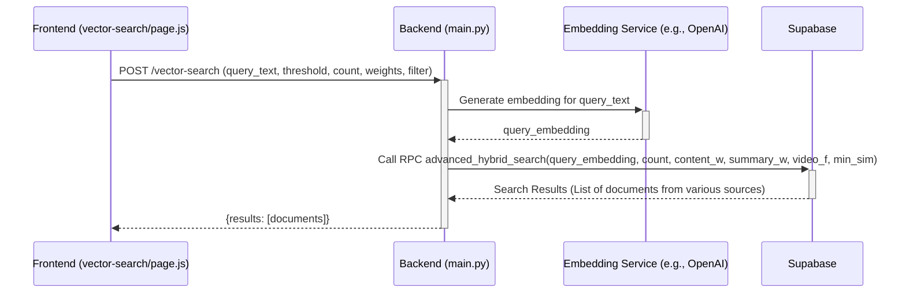

# Plan: Enhancing Web Content Fetching Tool with PDF Generation, Supabase Integration, and Vector Search

**Version:** 1.2
**Date:** 2025-05-07 (Updated)

## 1. Introduction

This document outlines the plan to enhance the backend of the web content fetching tool. The primary objectives are:
1.  Integrate PDF generation from fetched markdown content.
2.  Implement secure endpoints for serving these PDFs.
3.  Improve the robustness of interactions with the Jina Reader API.
4.  Make key paths configurable.
5.  **Integrate with the existing Supabase schema to store fetched web content (markdown, PDF path) and its vector embeddings by modifying the `webpage_content` table.**
6.  **Enable vector similarity search on the stored web content by modifying existing advanced SQL search functions.**

This plan is based on the context provided, including existing frontend expectations ([`src/app/fetch/page.js`](src/app/fetch/page.js), [`src/app/vector-search/page.js`](src/app/vector-search/page.js)), backend code structure, and the existing Supabase schema and functions found in `PMOVES Supabase/supabasedocs/`.

## 2. Assumptions

*   The frontend ([`src/app/fetch/page.js`](src/app/fetch/page.js)) correctly calls the backend `/fetch-content` endpoint and will be able to consume a `pdf_path` from its response.
*   The frontend search page ([`src/app/vector-search/page.js`](src/app/vector-search/page.js)) will interact with a backend endpoint that leverages the modified Supabase search functions.
*   `wkhtmltopdf` is the chosen tool for PDF conversion and is expected to be available in the deployment environment.
*   The Jina Reader API endpoint is `https://r.jina.ai/`.
*   The backend is built using FastAPI.
*   The `pgvector` extension is enabled in Supabase, and the vector dimension used is `1536` (consistent with existing tables like `document_embeddings`).
*   OpenAI's `text-embedding-ada-002` model (or another model producing 1536-dimension embeddings) will be used.

## 3. Detailed Plan

### 3.1. Integrate PDF Generation

**Goal:** Modify the backend to generate a PDF from markdown content fetched via Jina API and return its path.

**Affected Files:**
*   [`backend/app/fetch_content.py`](backend/app/fetch_content.py)
*   [`backend/app/main.py`](backend/app/main.py)

**Tasks:**

1.  **Modify `fetch_content_from_url()` in [`backend/app/fetch_content.py`](backend/app/fetch_content.py):**
    *   **Location:** Within the [`fetch_content_from_url()` function](backend/app/fetch_content.py:41), after successfully receiving markdown content from the Jina API.
    *   **Action:**
        *   Call the existing [`convert_markdown_to_pdf(markdown_content, output_filename)`](backend/app/fetch_content.py:382) function.
        *   `markdown_content`: The content retrieved from Jina.
        *   `output_filename`: Construct a unique filename for the PDF (e.g., using a UUID or a sanitized version of the URL slug + timestamp) to avoid collisions.
    *   **PDF Storage:**
        *   Define a base directory for storing PDFs. This should be configurable (see Section 3.4). For now, assume a subdirectory like `backend/app/temp_pdfs/`.
        *   The `output_filename` for [`convert_markdown_to_pdf()`](backend/app/fetch_content.py:382) should include this path. Example: `backend/app/temp_pdfs/unique_id.pdf`.
        *   Ensure this directory is created if it doesn't exist.
    *   **Return Value:** The function should return the generated PDF's relative path (e.g., `temp_pdfs/unique_id.pdf`), the markdown content, and the original URL. This information will be used by the calling endpoint in `main.py`.

2.  **Update `/fetch-content` Endpoint in [`backend/app/main.py`](backend/app/main.py):**
    *   **Location:** The route handler for `/fetch-content` (around [line 1671](backend/app/main.py:1671) or its corresponding function).
    *   **Action (Extended):**
        *   Modify the endpoint to accept an optional query parameter, e.g., `generate_pdf: bool = True`.
        *   If `generate_pdf` is `True` (the default), call [`fetch_content_from_url()`](backend/app/fetch_content.py:41) and expect it to handle PDF generation internally if successful.
        *   After successfully fetching content (markdown, url) and optionally generating a PDF path:
            *   Generate an embedding for the fetched markdown content (see Section 3.5).
            *   Call the modified `upsert_webpage_content` SQL function in Supabase (see Section 3.5) to store/update the URL, title (can be derived from Jina or webpage metadata), markdown content, the new PDF path (if generated), and the new embedding.
        *   The JSON response from this endpoint must include the `pdf_path` key if a PDF was generated. If `generate_pdf` is `False`, skip PDF generation steps, `pdf_path` should not be included or be `null`, and no PDF path is stored in Supabase.

**Key Considerations:**
*   **Uniqueness of PDF filenames:** Prevent overwriting.
*   **Error handling during PDF generation:** If [`convert_markdown_to_pdf()`](backend/app/fetch_content.py:382) fails, log the error. The `pdf_path` should not be returned or stored in Supabase in case of PDF generation failure.
*   **Temporary file cleanup strategy:** Consider if generated PDFs are temporary or should persist. If temporary, a cleanup mechanism might be needed (out of scope for immediate plan).
*   **Embedding Generation Failures:** If embedding generation fails, decide whether to store the content in Supabase without an embedding or return an error to the client.

### 3.2. Implement PDF Serving Endpoints

**Goal:** Create backend endpoints to allow the frontend to view and download the generated PDFs.

**Affected Files:**
*   [`backend/app/main.py`](backend/app/main.py)

**Tasks:**

Choose **one** of the following approaches (Option B is recommended for clarity):

**Option A: Single Generic File Serving Endpoint**

1.  **Create `GET /files/{file_path:path}` Endpoint:**
    *   **Action:** Implement an endpoint that serves static files from the configured PDF storage directory.
    *   Use FastAPI's `FileResponse`.
    *   The `file_path` parameter would correspond to the `pdf_path` returned by `/fetch-content` (e.g., `temp_pdfs/unique_id.pdf`).
    *   **Security:**
        *   Construct the full, absolute path to the PDF file by joining the configured PDF base directory with the user-provided `file_path`.
        *   Validate that the resolved path is still within the designated PDF storage directory to prevent directory traversal attacks (e.g., by checking if `os.path.abspath(resolved_path).startswith(os.path.abspath(pdf_storage_dir))`).
    *   **Content-Type & Disposition:** This single endpoint would need a way to determine if it's for viewing (`inline`) or download (`attachment`). This could be an additional query parameter (e.g., `?disposition=inline` or `?disposition=attachment`).

**Option B: Distinct View and Download Endpoints (Recommended)**

1.  **Create `GET /view-pdf` Endpoint:**
    *   **Action:**
        *   Accept a query parameter, e.g., `path: str`.
        *   Construct the full, absolute path to the PDF file by joining the configured PDF base directory with the `path` parameter.
        *   **Security:** Implement the same path validation as described in Option A.
        *   Use FastAPI's `FileResponse`.
        *   Set `media_type="application/pdf"`.
        *   Set `headers={"Content-Disposition": "inline"}`.
    *   **Example Call:** `GET http://localhost:8000/view-pdf?path=temp_pdfs/unique_id.pdf`

2.  **Create `GET /download-pdf` Endpoint:**
    *   **Action:**
        *   Accept a query parameter, e.g., `path: str`.
        *   Construct the full, absolute path to the PDF file by joining the configured PDF base directory with the `path` parameter.
        *   **Security:** Implement the same path validation.
        *   Use FastAPI's `FileResponse`.
        *   Set `media_type="application/pdf"`.
        *   Set `filename="downloaded_content.pdf"` (or derive from original filename if desired).
        *   Set `headers={"Content-Disposition": "attachment; filename=\"downloaded_content.pdf\""}`.
    *   **Example Call:** `GET http://localhost:8000/download-pdf?path=temp_pdfs/unique_id.pdf`

**Key Considerations:**
*   **Path Normalization:** Normalize paths before validation (e.g., using `os.path.normpath`).
*   **Error Handling:** If the file is not found or access is denied (due to security validation), return appropriate HTTP status codes (e.g., 404 Not Found, 403 Forbidden).

### 3.3. Enhance Robustness & Error Handling for Jina API

**Goal:** Make the Jina API integration in [`fetch_content_from_url()`](backend/app/fetch_content.py:41) more resilient to errors.

**Affected Files:**
*   [`backend/app/fetch_content.py`](backend/app/fetch_content.py)

**Tasks:**

1.  **Review and Modify Jina API Call in [`fetch_content_from_url()`](backend/app/fetch_content.py:109) (around line 171):**
    *   **Action:** Wrap the `aiohttp.ClientSession.get()` call and subsequent processing in a `try...except` block.
    *   **Catch Specific `aiohttp` Exceptions:**
        *   `aiohttp.ClientConnectorError`: For network connectivity issues.
        *   `aiohttp.ClientResponseError`: For HTTP status codes indicating errors from Jina. Check `response.status`.
        *   `asyncio.TimeoutError` (or `aiohttp.ServerTimeoutError`): For request timeouts.
        *   Other relevant exceptions like `aiohttp.ClientError`.
    *   **Logging:**
        *   Log detailed error information when an exception occurs. Include URL, error type, Jina's status code/response body (if available and safe).
        *   Use Python's `logging` module.
    *   **Informative Error Messages:**
        *   If Jina API call fails, [`fetch_content_from_url()`](backend/app/fetch_content.py:41) should propagate this.
        *   The `/fetch-content` endpoint in [`main.py`](backend/app/main.py) should translate this into a user-friendly JSON error response.
    *   **Retries with Backoff (Optional but Recommended):**
        *   Implement a retry mechanism for transient errors (e.g., network glitches, Jina 5xx errors) using libraries like `tenacity` or a custom loop.
        *   Define a maximum number of retries and backoff strategy.

**Key Considerations:**
*   **Jina API Rate Limits:** Be mindful if implementing aggressive retries.
*   **Timeout Configuration:** Ensure appropriate timeouts for the `aiohttp` request.

### 3.4. Configuration

**Goal:** Make critical paths and settings configurable for better portability and maintainability.

**Affected Files:**
*   [`backend/app/fetch_content.py`](backend/app/fetch_content.py)
*   [`backend/app/main.py`](backend/app/main.py)
*   Potentially a new configuration file (e.g., `backend/app/config.py`) or use of environment variables.

**Tasks:**

1.  **`wkhtmltopdf` Path Configuration:**
    *   **Current State:** Hardcoded in [`convert_markdown_to_pdf()`](backend/app/fetch_content.py:407).
    *   **Action:** Modify [`convert_markdown_to_pdf()`](backend/app/fetch_content.py:382) to read the `wkhtmltopdf` path from an environment variable (e.g., `WKHTMLTOPDF_PATH`), with a sensible default or making it required. Update documentation.
    *   **Example (in `fetch_content.py`):**
        ```python
        import os
        wkhtmltopdf_path = os.getenv('WKHTMLTOPDF_PATH', 'C:\\Program Files\\wkhtmltopdf\\bin\\wkhtmltopdf.exe')
        config = pdfkit.configuration(wkhtmltopdf=wkhtmltopdf_path)
        ```

2.  **PDF Storage Path Configuration:**
    *   **Action:** Define an environment variable (e.g., `PDF_STORAGE_PATH`) for the base PDF storage directory. Default to a relative path like `backend/app/temp_pdfs/`. Used in [`fetch_content.py`](backend/app/fetch_content.py) and [`main.py`](backend/app/main.py). Ensure write permissions. Update documentation.
    *   **Example (usage):**
        ```python
        import os
        PDF_BASE_DIR = os.getenv('PDF_STORAGE_PATH', 'backend/app/temp_pdfs')
        os.makedirs(PDF_BASE_DIR, exist_ok=True)
        pdf_output_path = os.path.join(PDF_BASE_DIR, unique_filename)
        ```

3.  **Supabase Configuration:**
    *   **Action:** Add environment variables: `SUPABASE_URL`, `SUPABASE_KEY`. Used by the Supabase client. Update documentation.

4.  **Embedding Model Configuration:**
    *   **Action:** Add environment variables:
        *   `EMBEDDING_MODEL_NAME` (e.g., `text-embedding-ada-002`).
        *   `EMBEDDING_DIMENSION` (fixed to `1536` based on existing schema).
        *   `OPENAI_API_KEY` (if using OpenAI).
    *   Update documentation.

**Key Considerations:**
*   **Configuration Loading Strategy:** Consistent approach (e.g., `python-dotenv`).
*   **Security of Configurable Paths and Keys:** Emphasize correct and secure setup in documentation.

### 3.5. Supabase Integration: Modify Existing Structures for Web Content

**Goal:** Adapt the existing `webpage_content` table and its upsert function to store fetched web content, its PDF path, and its vector embedding.

**Affected Files:**
*   SQL script for table alteration and function modification (e.g., update `PMOVES Supabase/supabasedocs/create_all_tables_and_functions.sql` or create a new migration script).
*   [`backend/app/main.py`](backend/app/main.py) (or a Supabase interaction module).

**Tasks:**

1.  **Modify `webpage_content` Table Schema:**
    *   **Action:** Add the following columns to the existing `webpage_content` table.
        *   `embedding VECTOR(1536) NULL`
        *   `pdf_path TEXT NULL`
    *   The existing `title TEXT NOT NULL` column will be used. The `content TEXT NOT NULL` will store markdown. `url TEXT NOT NULL` stores the source URL.
    *   **SQL Example (Alter Table):**
        ```sql
        -- Ensure the vector extension is enabled first: CREATE EXTENSION IF NOT EXISTS vector;

        ALTER TABLE webpage_content
        ADD COLUMN IF NOT EXISTS embedding VECTOR(1536) NULL,
        ADD COLUMN IF NOT EXISTS pdf_path TEXT NULL;

        -- Optional: Add an index for the new embedding column if direct queries are anticipated
        -- CREATE INDEX IF NOT EXISTS idx_webpage_content_embedding ON webpage_content USING ivfflat (embedding vector_cosine_ops) WITH (lists = 100);
        -- Note: The primary search will be via the advanced_hybrid_search function.
        ```

2.  **Implement Embedding Generation Logic:**
    *   **Location:** Likely in [`backend/app/main.py`](backend/app/main.py) or a new utility module.
    *   **Action:**
        *   Use the configured embedding model (e.g., OpenAI's `text-embedding-ada-002`, ensuring 1536 dimensions).
        *   Implement a function that takes markdown text as input and returns its 1536-dimension vector embedding.
        *   Handle API errors from the embedding service (e.g., OpenAI).

3.  **Modify `upsert_webpage_content` SQL Function:**
    *   **Action:** Update the existing [`upsert_webpage_content`](PMOVES%20Supabase/supabasedocs/create_all_tables_and_functions.sql:455) function in Supabase to accept and store/update the new `embedding` and `pdf_path` fields.
    *   **SQL Example (Modified Function Signature and Logic - conceptual):**
        ```sql
        CREATE OR REPLACE FUNCTION public.upsert_webpage_content(
          p_content_id text,          -- Existing
          p_title text,               -- Existing
          p_url text,                 -- Existing
          p_content text,             -- Existing
          p_embedding vector(1536),   -- New parameter
          p_pdf_path text,            -- New parameter
          p_source_file text DEFAULT NULL -- Existing (consider if still needed or if pdf_path replaces its use for webpages)
        )
        RETURNS text
        LANGUAGE plpgsql
        AS $$
        DECLARE
          exists_already boolean;
          existing_id text;
          result record;
        BEGIN
          -- Assuming check_webpage_duplicate(p_url) correctly identifies existing records by URL
          SELECT * FROM check_webpage_duplicate(p_url) INTO result;
          exists_already := result."exists";
          existing_id := result.content_id;
          
          IF exists_already THEN
            UPDATE webpage_content
            SET 
              title = p_title,
              content = p_content,
              embedding = p_embedding,     -- Store new embedding
              pdf_path = p_pdf_path,       -- Store new pdf_path
              source_file = COALESCE(p_source_file, webpage_content.source_file), -- Review usage of p_source_file
              upload_date = CURRENT_TIMESTAMP -- Or use your updated_at trigger if one exists for this table
            WHERE webpage_content.content_id = existing_id;
            RETURN existing_id;
          ELSE
            -- Ensure p_content_id is unique if not handled by check_webpage_duplicate for new entries
            INSERT INTO webpage_content(content_id, title, url, content, embedding, pdf_path, source_file, upload_date, created_at) -- Added created_at, upload_date
            VALUES (p_content_id, p_title, p_url, p_content, p_embedding, p_pdf_path, p_source_file, CURRENT_TIMESTAMP, CURRENT_TIMESTAMP);
            RETURN p_content_id;
          END IF;
        END;
        $$;
        ```
    *   The backend will call this modified SQL function with the new data.

### 3.6. Vector Search: Integrate Web Content into Existing Search Functions

**Goal:** Modify the existing advanced SQL search functions to include `webpage_content` as a searchable source, leveraging its new `embedding`.

**Affected Files:**
*   SQL script for function modification (e.g., update `PMOVES Supabase/supabasedocs/create_all_tables_and_functions.sql` or `PMOVES Supabase/supabasedocs/advanced_hybrid_search.sql`).
*   [`backend/app/main.py`](backend/app/main.py) (for calling the search function).

**Tasks:**

1.  **Modify `advanced_hybrid_search` SQL Function:**
    *   **Action:** Add a new `UNION ALL` block within the `ranked_results` CTE of the [`advanced_hybrid_search`](PMOVES%20Supabase/supabasedocs/create_all_tables_and_functions.sql:277) function to query the `webpage_content` table.
    *   **Details for the new `UNION ALL` block (to be inserted before the final `SELECT` from `ranked_results`):**
        ```sql
        -- Search in webpage_content table
        SELECT
            wpc.content AS content,
            'webpage_content' AS source,
            (1 - (wpc.embedding <=> query_embedding)) * content_weight AS similarity, -- Reuse content_weight or define a new one
            wpc.url AS video_id, -- Using URL as a general identifier, maps to 'video_id' in output
            NULL::INT AS segment_id,
            wpc.url AS watch_url, -- The original URL of the webpage
            NULL::TEXT AS start_time,
            NULL::TEXT AS end_time,
            wpc.title AS summary, -- Using title as summary for webpages
            wpc.content AS full_transcript, -- Using markdown content as full_transcript for webpages
            NULL::TEXT AS context_before,
            NULL::TEXT AS context_after,
            4 AS priority -- Assign a new priority, adjust existing if needed
        FROM webpage_content AS wpc
        WHERE wpc.embedding IS NOT NULL
          AND (1 - (wpc.embedding <=> query_embedding)) >= min_similarity
          -- AND (video_filter IS NULL) -- video_filter might not apply directly; adapt if needed
        ```
    *   Ensure the selected columns and their types match the return TABLE definition of `advanced_hybrid_search`. Adjust `priority` as needed relative to other sources.

2.  **Modify `dot_product_search` and `keyword_search` (Optional but Recommended for Consistency):**
    *   **Action:** Similarly, add `UNION ALL` blocks to [`dot_product_search`](PMOVES%20Supabase/supabasedocs/create_all_tables_and_functions.sql:183) (for vector search on `wpc.embedding`) and [`keyword_search`](PMOVES%20Supabase/supabasedocs/create_all_tables_and_functions.sql:124) (for text search on `wpc.content` and `wpc.title`) to include `webpage_content`. The structure would be similar to the `advanced_hybrid_search` modification, adapting to each function's specific output columns and logic.

3.  **Create/Update Backend `/vector-search` Endpoint in [`backend/app/main.py`](backend/app/main.py):**
    *   **Action:**
        *   This endpoint will accept a `query_text: str` and other relevant parameters from your existing search functions (e.g., `match_count`, `min_similarity`, `content_weight`, `summary_weight`, `video_filter`).
        *   Generate an embedding for the `query_text` (1536 dimensions).
        *   Call the modified `advanced_hybrid_search` (or other chosen search function) via `supabaseClient.rpc()` with all necessary arguments.
        *   Return the results.

**Key Considerations:**
*   **Parameter Mapping:** Ensure parameters passed from the backend to the SQL functions are correctly mapped.
*   **Return Structure:** The frontend ([`src/app/vector-search/page.js`](src/app/vector-search/page.js)) must be able to handle search results from the `webpage_content` source, displaying `url`, `title` (as summary), and `content` appropriately.
*   **Indexing:** The `webpage_content.embedding` column should be indexed for vector operations if not already covered by the search function's execution plan. An IVFFlat index is common: `CREATE INDEX IF NOT EXISTS idx_webpage_content_embedding ON webpage_content USING ivfflat (embedding vector_cosine_ops) WITH (lists = 100);` (adjust `lists` based on expected row count).

## 4. Diagrams

### 4.1. Sequence Diagram: `/fetch-content` with PDF and Supabase

```mermaid
sequenceDiagram
    participant FE as Frontend
    participant BE_Main as Backend (main.py)
    participant BE_Fetch as Backend (fetch_content.py)
    participant Jina as Jina Reader API
    participant PDFKit as PDFKit Utility
    participant EmbedService as Embedding Service (e.g., OpenAI)
    participant Supabase

    FE->>+BE_Main: POST /fetch-content (url, generate_pdf=true)
    BE_Main->>+BE_Fetch: fetch_content_from_url(url)
    BE_Fetch->>+Jina: GET https://r.jina.ai/?url=<url>
    Jina-->>-BE_Fetch: Markdown Content (or Error)
    alt Jina Call Successful
        BE_Fetch-->>BE_Main: raw_markdown, (original_url), title_from_jina
        opt generate_pdf is true
            BE_Main->>+PDFKit: convert_markdown_to_pdf(raw_markdown, output_path)
            PDFKit-->>-BE_Main: PDF saved, returns pdf_relative_path
        end
        BE_Main->>+EmbedService: Generate embedding for raw_markdown
        EmbedService-->>-BE_Main: vector_embedding
        BE_Main->>+Supabase: Call RPC upsert_webpage_content(content_id, title, url, raw_markdown, vector_embedding, pdf_relative_path)
        Supabase-->>-BE_Main: Upsert Success/Fail
        BE_Main-->>-FE: {content: raw_markdown, pdf_path: pdf_relative_path (if any), title: title_from_jina}
    else Jina Call Fails or Other Critical Error
        BE_Fetch-->>-BE_Main: {error_message}
        BE_Main-->>-FE: {error: error_message}
    end
```

### 4.2. Sequence Diagram: `/vector-search`



### 4.3. Component Diagram: Backend (Extended)

```mermaid
graph TD
    subgraph Backend Application
        A[main.py FastAPI App] --> B{/fetch-content}
        A --> C{/view-pdf}
        A --> D{/download-pdf}
        A --> NEW_SEARCH_ENDPOINT{/vector-search}

        B --> E[fetch_content.py: fetch_content_from_url]
        E --> F[Jina Reader API Client]
        B --> G[fetch_content.py: convert_markdown_to_pdf]
        G --> H[PDFKit Library]
        H -- Uses --> I[wkhtmltopdf]

        B --> EMBED_SVC_CLIENT[Embedding Service Client]
        B --> SUPA_CLIENT[Supabase Client Lib]
        NEW_SEARCH_ENDPOINT --> EMBED_SVC_CLIENT
        NEW_SEARCH_ENDPOINT --> SUPA_CLIENT

        C --> FS_PDF[File System: PDF Storage]
        D --> FS_PDF
        G -- Saves to --> FS_PDF
    end

    subgraph External Services
        F --> K[Jina Reader API (r.jina.ai)]
        EMBED_SVC_CLIENT --> EMBED_API[Embedding API (e.g., OpenAI)]
        SUPA_CLIENT -- Interacts with --> SUPA_DB[Supabase Database (pgvector & SQL Functions)]
    end

    subgraph Configuration
        L[Environment Variables / Config File] --> A
        L --> E
        L --> G
        L --> EMBED_SVC_CLIENT
        L --> SUPA_CLIENT
        M[WKHTMLTOPDF_PATH] --> L
        N[PDF_STORAGE_PATH] --> L
        O[SUPABASE_URL, SUPABASE_KEY] --> L
        P[EMBEDDING_MODEL_NAME, EMBEDDING_DIMENSION, OPENAI_API_KEY] --> L
    end
```

## 5. Next Steps

This updated plan aligns the new web content fetching and embedding process with your existing Supabase infrastructure. Implementation will involve careful modification of SQL schemas and functions, alongside backend Python code. Thorough testing of both the data ingestion and the modified search functionalities across all content types will be critical. This includes verifying that `webpage_content` results are correctly returned and displayed by the frontend.