# Fetch Page UI/UX Enhancement - Implementation Subtasks

This document outlines the prioritized subtasks for implementing the Fetch Page UI/UX enhancements, based on the "Fetch Page UI/UX Enhancement Plan" ([`docs/fetch_page_enhancement_plan.md`](docs/fetch_page_enhancement_plan.md:1)).

```mermaid
graph TD
    A[Start: Fetch Page Enhancement] --> B(Backend: Core Engine Integration);
    B --> C(Backend: SSE for Basic Progress);
    C --> D(Frontend: Basic Fetch Form UI - Engine Selection & URL);
    D --> E(Frontend: State Management for Basic Form);
    E --> F(Frontend: Implement Basic Fetch Request with Engine Choice);
    F --> G(Frontend: Basic Progress Display UI);
    G --> H(Backend: Fetch History - API & DB Schema);
    H --> I(Frontend: Fetch History - Basic Table UI & Data Fetching);
    I --> J(Frontend: Advanced Options - Common & Jina);
    J --> K(Frontend: Advanced Options - `crawl4ai` - Browser & Navigation);
    K --> L(Frontend: Advanced Options - `crawl4ai` - Content Extraction);
    L --> M(Frontend: Advanced Options - `crawl4ai` - Page Interaction);
    M --> N(Frontend: Advanced Options - `crawl4ai` - Caching & Media);
    N --> O(Frontend: Advanced Options - `crawl4ai` - Link Filtering & Compliance);
    O --> P(Frontend: Advanced Options - `crawl4ai` - Debugging & LLM Stubs);
    P --> Q(Frontend: Fetched Content Viewer - Markdown & Basic PDF);
    Q --> R(Frontend: Fetch History - Actions: View, Re-fetch, Delete);
    R --> S(Backend: `crawl4ai` Full Parameter Integration & Advanced SSE);
    S --> T(Frontend: Refine `crawl4ai` Advanced Options UI & State);
    T --> U(Frontend: Structured Data Viewer for `crawl4ai`);
    U --> V(Styling & UX Refinements);
    V --> W[End: Enhancements Complete];
```

## Implementation Subtasks:

**Phase 1: Core Functionality & Basic UI**

1.  **Subtask:** Backend - Core Fetch Engine Integration
    *   **Work:** Modify backend API ([`backend/app/main.py`](../backend/app/main.py:1)) to accept an `engine` parameter (`jina` or `crawl4ai`). Implement basic routing to either existing Jina logic or a new `crawl4ai` module. Install `crawl4ai`.
    *   **Relevant File(s):** [`backend/app/main.py`](../backend/app/main.py:1), new `crawl4ai_fetcher.py` (conceptual).
    *   **Recommended Mode:** Senior
    *   **Priority:** 1

2.  **Subtask:** Backend - Database Schema for Fetch History
    *   **Work:** Design and implement DB schema for fetch history (engine, parameters, output type, URL, date, status, title).
    *   **Relevant File(s):** SQL migration scripts ([`migrations/`](../migrations/)), backend DB logic.
    *   **Recommended Mode:** Midlevel
    *   **Priority:** 2

3.  **Subtask:** Backend - Basic API for Fetch History (Create & List)
    *   **Work:** Create backend API endpoints to save and list fetch jobs.
    *   **Relevant File(s):** [`backend/app/main.py`](../backend/app/main.py:1).
    *   **Recommended Mode:** Midlevel
    *   **Priority:** 3

4.  **Subtask:** Frontend - Basic Fetch Form UI & Engine Selection
    *   **Work:** Modify [`src/components/fetch/FetchForm.jsx`](../src/components/fetch/FetchForm.jsx:1) for "Fetching Engine" selector and URL input.
    *   **Relevant File(s):** [`src/components/fetch/FetchForm.jsx`](../src/components/fetch/FetchForm.jsx:1), [`src/app/fetch/page.js`](../src/app/fetch/page.js:1).
    *   **Recommended Mode:** Junior
    *   **Priority:** 4

5.  **Subtask:** Frontend - State Management for Basic Form
    *   **Work:** Update frontend state for `fetchingEngine` and URL.
    *   **Relevant File(s):** [`src/components/fetch/FetchForm.jsx`](../src/components/fetch/FetchForm.jsx:1), [`src/app/fetch/page.js`](../src/app/fetch/page.js:1).
    *   **Recommended Mode:** Junior
    *   **Priority:** 5

6.  **Subtask:** Frontend - Implement Basic Fetch Request with Engine Choice
    *   **Work:** Update fetch submission logic to include `fetchingEngine`.
    *   **Relevant File(s):** [`src/components/fetch/FetchForm.jsx`](../src/components/fetch/FetchForm.jsx:1).
    *   **Recommended Mode:** Midlevel
    *   **Priority:** 6

**Phase 2: Progress Display & Initial History View**

7.  **Subtask:** Backend - SSE for Basic Progress
    *   **Work:** Implement/refine backend SSE for basic progress updates (Jina & `crawl4ai`).
    *   **Relevant File(s):** [`backend/app/main.py`](../backend/app/main.py:1).
    *   **Recommended Mode:** Senior
    *   **Priority:** 7

8.  **Subtask:** Frontend - Basic Progress Display UI
    *   **Work:** Create `FetchProgressTracker.jsx` for progress bar, status updates (SSE), and Cancel button stub. Integrate into [`src/app/fetch/page.js`](../src/app/fetch/page.js:1).
    *   **Relevant File(s):** New `src/components/fetch/FetchProgressTracker.jsx`, [`src/app/fetch/page.js`](../src/app/fetch/page.js:1).
    *   **Recommended Mode:** Midlevel
    *   **Priority:** 8

9.  **Subtask:** Frontend - Fetch History Basic Table UI
    *   **Work:** Create `FetchHistoryTable.jsx` to display fetched items (URL, Date, Status, Engine). Integrate into "Fetch History" tab in [`src/app/fetch/page.js`](../src/app/fetch/page.js:1).
    *   **Relevant File(s):** New `src/components/fetch/FetchHistoryTable.jsx`, [`src/app/fetch/page.js`](../src/app/fetch/page.js:1).
    *   **Recommended Mode:** Midlevel
    *   **Priority:** 9

**Phase 3: Advanced Options - Standard Fetch & Initial `crawl4ai`**

10. **Subtask:** Frontend - "Advanced Options" Structure & Common Options
    *   **Work:** Modify [`src/components/fetch/AdvancedFetchOptions.jsx`](../src/components/fetch/AdvancedFetchOptions.jsx:1) for conditional display based on engine. Implement UI for "Common Advanced Options" and Jina.ai specifics.
    *   **Relevant File(s):** [`src/components/fetch/AdvancedFetchOptions.jsx`](../src/components/fetch/AdvancedFetchOptions.jsx:1), [`src/components/fetch/FetchForm.jsx`](../src/components/fetch/FetchForm.jsx:1).
    *   **Recommended Mode:** Midlevel
    *   **Priority:** 10

11. **Subtask:** Frontend - `crawl4ai` Basic Options UI (Depth, Target Content)
    *   **Work:** Implement UI in [`src/components/fetch/FetchForm.jsx`](../src/components/fetch/FetchForm.jsx:1) for `Fetch Depth` and `Target Content Area` (presets & advanced selector for `crawl4ai`).
    *   **Relevant File(s):** [`src/components/fetch/FetchForm.jsx`](../src/components/fetch/FetchForm.jsx:1).
    *   **Recommended Mode:** Junior
    *   **Priority:** 11

12. **Subtask:** Frontend - `crawl4ai` Advanced Options - Browser & Navigation
    *   **Work:** Implement UI in [`src/components/fetch/AdvancedFetchOptions.jsx`](../src/components/fetch/AdvancedFetchOptions.jsx:1) (or new `Crawl4aiAdvancedOptions.jsx`) for `crawl4ai`'s "Browser & Navigation Settings".
    *   **Relevant File(s):** [`src/components/fetch/AdvancedFetchOptions.jsx`](../src/components/fetch/AdvancedFetchOptions.jsx:1) or new `Crawl4aiAdvancedOptions.jsx`.
    *   **Recommended Mode:** Midlevel
    *   **Priority:** 12

13. **Subtask:** Frontend - State Management for Advanced Options (Standard & Basic `crawl4ai`)
    *   **Work:** Extend frontend state for new advanced options (Standard & initial `crawl4ai`).
    *   **Relevant File(s):** [`src/components/fetch/FetchForm.jsx`](../src/components/fetch/FetchForm.jsx:1), [`src/components/fetch/AdvancedFetchOptions.jsx`](../src/components/fetch/AdvancedFetchOptions.jsx:1), state files.
    *   **Recommended Mode:** Midlevel
    *   **Priority:** 13

**Phase 4: Expanding `crawl4ai` Options & Fetch History Actions**

14. **Subtask:** Backend - `crawl4ai` Parameter Integration (Browser, Navigation, Basic Content)
    *   **Work:** Extend backend `crawl4ai` logic for "Browser & Navigation" and basic "Content Extraction" parameters.
    *   **Relevant File(s):** Backend `crawl4ai_fetcher.py`, [`backend/app/main.py`](../backend/app/main.py:1).
    *   **Recommended Mode:** Senior
    *   **Priority:** 14

15. **Subtask:** Frontend - `crawl4ai` Advanced Options - Content Extraction & Processing
    *   **Work:** Implement UI for `crawl4ai`'s "Content Extraction & Processing" settings.
    *   **Relevant File(s):** [`src/components/fetch/AdvancedFetchOptions.jsx`](../src/components/fetch/AdvancedFetchOptions.jsx:1) or `Crawl4aiAdvancedOptions.jsx`.
    *   **Recommended Mode:** Midlevel
    *   **Priority:** 15

16. **Subtask:** Frontend - `crawl4ai` Advanced Options - Page Interaction & Automation
    *   **Work:** Implement UI for `crawl4ai`'s "Page Interaction & Automation" settings.
    *   **Relevant File(s):** [`src/components/fetch/AdvancedFetchOptions.jsx`](../src/components/fetch/AdvancedFetchOptions.jsx:1) or `Crawl4aiAdvancedOptions.jsx`.
    *   **Recommended Mode:** Midlevel
    *   **Priority:** 16

17. **Subtask:** Frontend - Fetched Content Viewer (Markdown, PDF)
    *   **Work:** Create/Refine `FetchedContentViewer.jsx` for Markdown & PDF outputs from Jina and initial `crawl4ai`.
    *   **Relevant File(s):** New/existing `FetchedContentViewer.jsx`, [`src/app/fetch/page.js`](../src/app/fetch/page.js:1).
    *   **Recommended Mode:** Midlevel
    *   **Priority:** 17

18. **Subtask:** Backend - API for Fetch History (Update & Delete)
    *   **Work:** Implement backend API endpoints for deleting and potentially updating fetch history items.
    *   **Relevant File(s):** [`backend/app/main.py`](../backend/app/main.py:1).
    *   **Recommended Mode:** Midlevel
    *   **Priority:** 18

19. **Subtask:** Frontend - Fetch History Actions (View, Delete, Re-fetch Stubs)
    *   **Work:** In `FetchHistoryTable.jsx`, add "View Content", "Delete", and "Re-fetch" (stub) action buttons.
    *   **Relevant File(s):** `src/components/fetch/FetchHistoryTable.jsx`.
    *   **Recommended Mode:** Junior
    *   **Priority:** 19

**Phase 5: Full `crawl4ai` Integration & Refinements**

20. **Subtask:** Backend - `crawl4ai` Full Parameter Integration
    *   **Work:** Complete backend integration for all remaining `crawl4ai` parameters.
    *   **Relevant File(s):** Backend `crawl4ai_fetcher.py`, [`backend/app/main.py`](../backend/app/main.py:1).
    *   **Recommended Mode:** Senior
    *   **Priority:** 20

21. **Subtask:** Frontend - `crawl4ai` Advanced Options - Remaining Categories
    *   **Work:** Implement UI for `crawl4ai`'s "Caching", "Media Handling", "Link & Domain Filtering", "Compliance", "Debugging & Logging".
    *   **Relevant File(s):** [`src/components/fetch/AdvancedFetchOptions.jsx`](../src/components/fetch/AdvancedFetchOptions.jsx:1) or `Crawl4aiAdvancedOptions.jsx`.
    *   **Recommended Mode:** Midlevel
    *   **Priority:** 21

22. **Subtask:** Frontend - State Management for All `crawl4ai` Options
    *   **Work:** Ensure all `crawl4ai` advanced options are covered by frontend state and passed to backend.
    *   **Relevant File(s):** State management files, advanced options components.
    *   **Recommended Mode:** Midlevel
    *   **Priority:** 22

23. **Subtask:** Frontend - Implement "Re-fetch" Functionality
    *   **Work:** Fully implement "Re-fetch" to pre-fill form with original URL, engine, and options.
    *   **Relevant File(s):** `src/components/fetch/FetchHistoryTable.jsx`, [`src/components/fetch/FetchForm.jsx`](../src/components/fetch/FetchForm.jsx:1), state management.
    *   **Recommended Mode:** Midlevel
    *   **Priority:** 23

24. **Subtask:** Frontend - Implement Cancel Fetch Functionality
    *   **Work:** Implement "Cancel" button in `FetchProgressTracker.jsx` with backend API call.
    *   **Relevant File(s):** `src/components/fetch/FetchProgressTracker.jsx`, backend fetch logic.
    *   **Recommended Mode:** Senior
    *   **Priority:** 24

25. **Subtask:** Frontend - Structured Data Viewer (for `crawl4ai` JSON output)
    *   **Work:** Create `StructuredDataViewer.jsx` for `crawl4ai` JSON output; integrate into `FetchedContentViewer.jsx`.
    *   **Relevant File(s):** New `StructuredDataViewer.jsx`, `FetchedContentViewer.jsx`.
    *   **Recommended Mode:** Midlevel
    *   **Priority:** 25

26. **Subtask:** Styling & UX Refinements
    *   **Work:** General UI polish, consistent styling, tooltips, layout, responsiveness.
    *   **Relevant File(s):** All new/modified JSX and CSS files.
    *   **Recommended Mode:** Designer
    *   **Priority:** 26