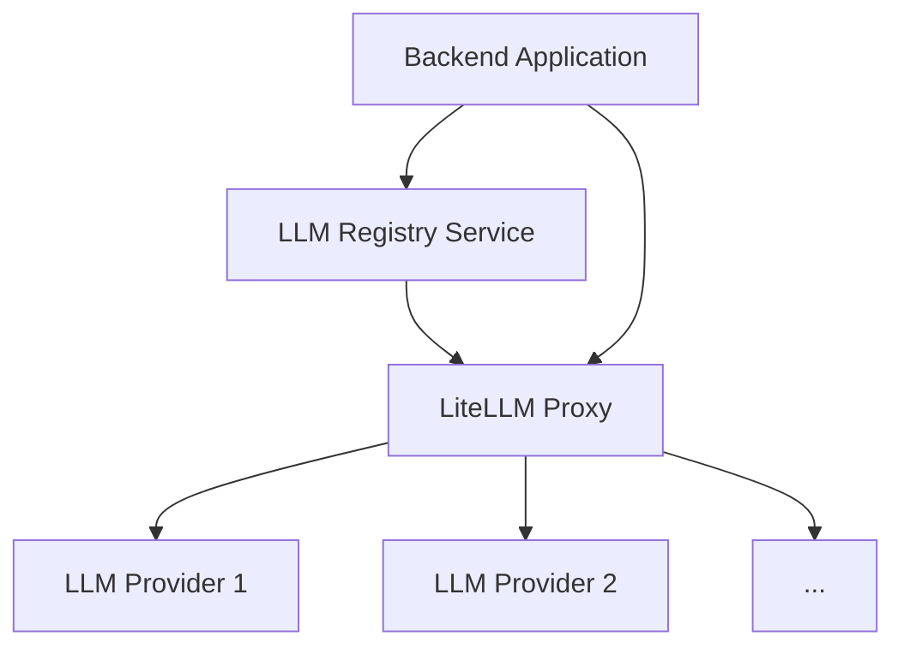

# LLM Model Management System

This document explains the centralized system for managing LLM models using a LiteLLM proxy and the backend's LLM registry service.

## Architecture Overview

The system utilizes a LiteLLM proxy as a central gateway to various LLM providers (cloud and local). The backend application includes an `llm_registry_service` that fetches available models and their capabilities from the proxy's `/models` endpoint. Other backend components and agents interact with the `llm_registry_service` to select and use LLM models dynamically, routing their calls through the LiteLLM proxy.



## Configuration

LLM providers and models are configured primarily through the `litellm_proxy_config/config.yaml` file.

1.  **Edit `litellm_proxy_config/config.yaml`:**
    *   Add or update the `model_list` section to include configurations for your desired LLM providers.
    *   For each model, specify a `model_name` (the alias used in the backend), the actual provider model ID (`litellm_params.model`), and how API keys are sourced (e.g., `os.environ/PROVIDER_API_KEY`).
    *   Ensure `check_provider_endpoint: true` is set under `litellm_settings` to enable model discovery via the `/models` endpoint.
    *   Refer to the LiteLLM documentation in `docs/litellm/docs/my-website/docs/providers/` for provider-specific configuration details.

2.  **Environment Variables:**
    *   API keys and other sensitive configurations should be stored in environment variables.
    *   The LiteLLM proxy is configured to load these variables from the `backend/app/.env` file using the `--env-file` option in `docker-compose.litellm-proxy.yml`.
    *   Ensure your `backend/app/.env` file contains the necessary variables (e.g., `GROQ_API_KEY`, `GOOGLE_API_KEY`, `OPENAI_API_KEY`, `LITELLM_PROXY_API_KEY`).

## Running the System

The LiteLLM proxy and the backend application are run using separate Docker Compose files.

1.  **Start the LiteLLM Proxy:**
    ```bash
    docker-compose -f docker-compose.litellm-proxy.yml up -d
    ```
2.  **Start the Backend Application:**
    ```bash
    docker-compose -f docker-compose.backend.yml up --build -d
    ```

Ensure the LiteLLM proxy is running before starting the backend application, as the backend's LLM registry service attempts to fetch models from the proxy during startup.

## Using LLMs in Backend Components

Backend components that need to use LLMs should obtain the `LLMRegistryService` instance (typically available during application startup) and use its methods to retrieve model details based on the configured aliases. LLM calls are then routed through the LiteLLM proxy's data plane endpoints (e.g., `/v1/chat/completions`, `/v1/embeddings`), with the proxy handling the provider-specific routing and authentication.
