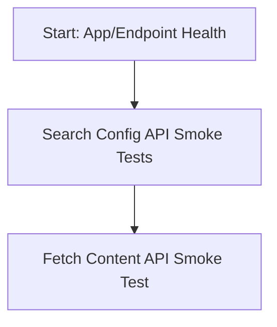
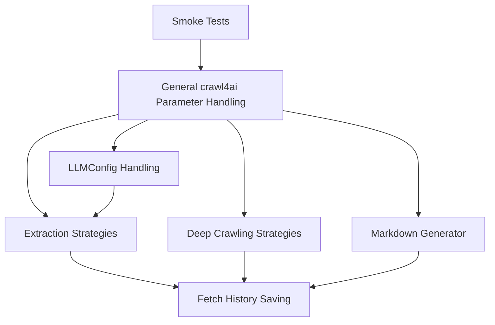
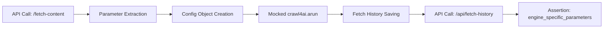

# Backend Testing Plan for `/fetch-content` and crawl4ai Integration

---

## Environment Setup

**Note:** These tests are intended to be run on a Windows PC using a PowerShell terminal.

Before running any tests, ensure that the Python virtual environment is activated. In PowerShell, use:

```powershell
.venv\Scripts\Activate.ps1
```

---

## Test Execution Requirement

**All tests described in this plan must be run and must pass.**

If any test fails, the code must be fixed so that all tests pass and this part of the project is fully functional. Passing these tests is a strict requirement for this component of the project to be considered working and complete.

---

## Agent Workflow

The following workflow should be followed by the agent responsible for ensuring this part of the project is functional:

1. **Run all tests described in this plan.**
2. **Note any test failures.**
3. **Consult the provided documentation** (see References section) and, if needed, use mcp tools to obtain additional or updated documentation relevant to the failure or the code being tested.
4. **Fix the code** so that all failing tests pass, using insights from the documentation and any additional resources gathered.
5. **Re-run the tests** to confirm that all now pass.
6. **Ensure the codebase reflects the intended functionality and requirements** as described in this test plan and the documentation.

This process should be repeated as necessary until all tests pass and the code is fully aligned with project requirements.

---

## 1. High-Level Overview of crawl4ai

- **Instantiation:**
  - `AsyncWebCrawler()` is initialized with an optional `BrowserConfig`.
  - Main method: `arun(url, config=CrawlerRunConfig)`.
- **Configuration:**
  - `BrowserConfig`: Global browser settings.
  - `CrawlerRunConfig`: Per-crawl settings (caching, filtering, extraction strategies, etc.).
- **Result:**
  - `arun()` returns a `CrawlResult` with outputs like markdown, cleaned_html, extracted_content, screenshot, etc.
- **Lifecycle:**
  - Use `async with AsyncWebCrawler(...) as crawler:` for resource management.

---

## 2. Analysis of Test Coverage and Dependencies

### Purpose and Coverage of Each Test File
- **test_search_config.py:**
  - Verifies the health and reachability of the API, especially for search configuration endpoints. Serves as a basic smoke test for the FastAPI app and routing.
- **test_crawl4ai_fetcher_general_options.py:**
  - Tests the mapping of API parameters to `BrowserConfig` and `CrawlerRunConfig` for crawl4ai. Includes type conversion, error handling, and default value checks. The smoke test here ensures `/fetch-content` is reachable and functional with crawl4ai.
- **test_crawl4ai_fetcher_llmconfig.py:**
  - Focuses on the instantiation and parameterization of `LLMConfig`, especially for LLM-based extraction. Tests precedence of API tokens, provider parsing, and error handling.
- **test_crawl4ai_fetcher_extraction_strategies.py:**
  - Tests the configuration and instantiation of various extraction strategies (LLM, CSS/JSON, Cosine, none/invalid). Also checks API token precedence and error handling for missing/invalid strategies.
- **test_crawl4ai_fetcher_deep_strategies.py:**
  - Covers deep crawling strategies (BFS, DFS, BestFirst), including integration with `FilterChain` and `URLScorer`. Ensures correct instantiation and error handling for missing or misconfigured strategies.
- **test_crawl4ai_fetcher_markdown_config.py:**
  - Tests the handling of the `markdown_generator` parameter, including default, empty, and unknown values.
- **test_fetch_history_saving.py:**
  - Full integration test that ensures all crawl4ai parameters are saved in the `engine_specific_parameters` field of the fetch history table, supporting reproducibility and "re-fetch" functionality.

### Rationale for Proposed Test Order
- **Smoke Tests First:**
  - Ensures the FastAPI app, routing, and endpoints are fundamentally working before running more complex tests.
- **Parameter Handling Next:**
  - Verifies that all general crawl4ai parameters are correctly parsed and mapped, as this is foundational for all subsequent strategy-specific and integration tests.
- **Strategy-Specific Tests:**
  - Once parameter handling is confirmed, tests for extraction, deep crawling, and markdown strategies ensure that these features are correctly configured and integrated.
- **Integration and History Saving Last:**
  - The fetch history saving test is run last, as it depends on the successful operation of all previous layers (parameter extraction, strategy configuration, and endpoint health).

### Key Dependencies Between Tests
- **Parameter Processing:**
  - All strategy-specific tests depend on correct general parameter handling. If parameter mapping fails, strategy instantiation will also fail.
- **LLMConfig:**
  - LLMExtractionStrategy tests require correct instantiation of LLMConfig. Any issues in LLMConfig handling will break LLM-based extraction.
- **Fetch History:**
  - The fetch history saving test depends on the `/fetch-content` endpoint processing requests correctly and extracting all relevant parameters.
- **Deep Crawl Components:**
  - BestFirstCrawlingStrategy depends on a URLScorer for effective operation. FilterChain is used by all deep crawl strategies.
- **API Endpoint Health:**
  - All tests depend on the FastAPI app and routing being functional, which is why smoke tests are prioritized.

### Notable Findings
- **API Token Precedence Discrepancy:**
  - There is a mismatch between the test plan (which expects the request parameter token to take precedence) and the current code (which prioritizes the `CRAWL4AI_LLM_API_TOKEN` environment variable). This is highlighted in both the LLMConfig and extraction strategy tests and needs to be resolved for consistency.
- **Comprehensive Parameter Saving:**
  - The integration test for fetch history saving is crucial for ensuring reproducibility. It verifies that all crawl4ai parameters, including defaults and user-supplied values, are persisted in the fetch history, enabling accurate "re-fetch" operations and auditability.

### Importance of the Analysis
- This analysis ensures that the test plan is not just a checklist, but a logical, dependency-aware sequence that maximizes early detection of foundational issues and supports robust, reproducible backend operations for crawl4ai integration.

---

## 3. Existing Test Coverage

### 3.1. Search Config API
- **File:** `backend/app/tests/test_search_config.py`
- **Endpoints:**
  - `/api/search-config` (GET/POST)
  - `/api/search-config/presets` (GET)
  - `/api/search-config/preset/{preset_name}` (GET)
  - `/vector-search-stream` (GET)

### 3.2. `/fetch-content` Endpoint (crawl4ai)
- **File:** `backend/app/tests/test_crawl4ai_fetcher_general_options.py`
- **Tests:**
  - Parameter mapping to `BrowserConfig` and `CrawlerRunConfig`
  - Type conversion, error handling, and defaults
  - Smoke test: `test_smoke_no_params_uses_defaults`

### 3.3. LLMConfig Handling
- **File:** `backend/app/tests/test_crawl4ai_fetcher_llmconfig.py`
- **Tests:**
  - LLM provider/model parsing
  - API token precedence (request vs. environment)
  - Base URL handling
  - Error handling

### 3.4. Extraction Strategies
- **File:** `backend/app/tests/test_crawl4ai_fetcher_extraction_strategies.py`
- **Tests:**
  - LLMExtractionStrategy, JsonCssExtractionStrategy, CosineStrategy
  - Handling of missing/invalid strategies
  - API token precedence

### 3.5. Deep Crawling Strategies
- **File:** `backend/app/tests/test_crawl4ai_fetcher_deep_strategies.py`
- **Tests:**
  - BFS, DFS, BestFirst strategies
  - FilterChain and URLScorer integration
  - Handling of "none" or missing strategies

### 3.6. Markdown Generator
- **File:** `backend/app/tests/test_crawl4ai_fetcher_markdown_config.py`
- **Tests:**
  - Default, empty, or unknown markdown generator handling

### 3.7. Fetch History Saving
- **File:** `backend/app/tests/test_fetch_history_saving.py`
- **Test:**
  - `test_save_crawl4ai_parameters_to_fetch_history`: Ensures all crawl4ai parameters are saved in `engine_specific_parameters` in the fetch history table.

---

## 4. Proposed Testing Sequence

### 4.1. Foundational "Smoke Tests"

- **Purpose:** Ensure FastAPI app, routing, and basic endpoints are working.
- **Tests:**
  - `test_get_search_config` (GET `/api/search-config`)
  - `test_get_presets` (GET `/api/search-config/presets`)
  - `test_smoke_no_params_uses_defaults` (GET `/fetch-content?url=http://example.com&engine=crawl4ai`)
  - **Status: PASSED**



### 4.2. Core crawl4ai Parameter Handling

- **File:** `test_crawl4ai_fetcher_general_options.py`
- **Tests:**
  - `test_various_parameter_combinations`
  - `test_browser_config_boolean_string_numeric`
  - `test_browser_config_json_parsing`
  - `test_browser_config_extra_args_list_parsing`
  - `test_crawler_run_config_boolean_string_numeric_float`
  - `test_crawler_run_config_list_parsing`
  - `test_type_conversion_graceful_handling`

- **Status: PASSED**
### 4.3. LLMConfig Instantiation and Parameter Handling

- **File:** `test_crawl4ai_fetcher_llmconfig.py`
- **Tests:**
  - `test_llmconfig_provider_parsing`
  - `test_llmconfig_api_token_precedence`
  - `test_llmconfig_base_url_handling`
  - `test_llmconfig_missing_provider_or_instructions`
  - `test_llmconfig_instantiation_errors`

- **Status: PASSED**
### 4.4. Extraction Strategy Configuration

- **File:** `test_crawl4ai_fetcher_extraction_strategies.py`
- **Tests:**
  - LLMExtractionStrategy: required/optional params, token precedence, missing params
  - JsonCssExtractionStrategy: valid/invalid/missing schema
  - CosineStrategy: instantiation
  - No/Invalid Strategy: none, missing, empty, invalid
- **Status: PARTIALLY VERIFIED BY LIVE TEST; SOME ASPECTS REQUIRE FURTHER DEDICATED TESTING**

The core functionality of `LLMExtractionStrategy` with its required parameters (e.g., `llm_provider_model`, `llm_instruction`) was successfully demonstrated by the `test_llm_extraction_live` scenario in `live_fetch_content_tester.py`. Research findings also confirm the robust integration of core extraction strategies (`LLMExtractionStrategy`, `JsonCssExtractionStrategy`, `CosineStrategy`) and that handling for "No/Invalid Strategy" scenarios for extraction is consistent with documentation (falling back to default behavior with logging).

However, the following specific aspects still require dedicated verification or implementation:
    *   Comprehensive API token precedence logic (e.g., request-level token vs. environment variable for strategies).
    *   Parsing and application of certain advanced customization parameters from API requests, specifically:
        *   For `LLMExtractionStrategy`: e.g., `schema`, `chunk_token_threshold`.
            *   **Update (2025-05-10):**
                *   API support for advanced parameters (`llm_extraction_type`, `llm_schema`, `llm_apply_chunking`, `llm_chunk_token_threshold`, `llm_overlap_rate`, `llm_input_format`) has been implemented in [`backend/app/crawl4ai_fetcher.py`](backend/app/crawl4ai_fetcher.py:0).
                *   A new test script, [`live_llm_extraction_advanced_tester.py`](live_llm_extraction_advanced_tester.py:0), with detailed test cases has been created. This script includes command-line arguments for selective test execution.
                *   Initial testing (Batch 1 from [`docs/livetest_instructions.md`](docs/livetest_instructions.md:0)) has commenced. Several fixes have been applied to both [`backend/app/crawl4ai_fetcher.py`](backend/app/crawl4ai_fetcher.py:0) (for LLM error handling) and [`live_llm_extraction_advanced_tester.py`](live_llm_extraction_advanced_tester.py:0) (for improved validation of `extracted_content` and handling of structured error responses).
                *   **Current Status & Next Steps:** Testing of advanced `LLMExtractionStrategy` parameters is ongoing. Key identified pending actions before completing all test batches include:
                    *   Resolving an issue where `fetch_history` status is incorrectly marked `failed` in [`backend/app/main.py`](backend/app/main.py:0) even on successful fetches (see Section 4.7).
                    *   Ensuring the backend consistently returns a clean, structured error in `extracted_content` if LLM calls fail, rather than internal error messages (further verification of the latest fix in [`backend/app/crawl4ai_fetcher.py`](backend/app/crawl4ai_fetcher.py:0) is needed).
                    *   Completing all test batches for `LLMExtractionStrategy` as outlined in [`docs/livetest_instructions.md`](docs/livetest_instructions.md:0).
        *   For `CosineStrategy`: e.g., custom constructor parameters.
        *   For `DefaultMarkdownGenerator`: e.g., `options` dict, `content_filter`.

### 4.5. Deep Crawling Strategy Configuration

- **File:** `test_crawl4ai_fetcher_deep_strategies.py`
- **Tests:**
  - BFS/DFS/BestFirst instantiation
  - FilterChain integration
  - KeywordRelevanceScorer integration
Note: Recent research findings further confirm the robust integration of core deep crawling strategies (`BFSDeepCrawlStrategy`, `DFSDeepCrawlStrategy`, `BestFirstCrawlingStrategy`) within `backend/app/crawl4ai_fetcher.py`. The handling of "No/Invalid Strategy" scenarios for deep crawling has also been verified as consistent with documentation, falling back to default behavior with appropriate logging. This reinforces the "PASSED" status for this section.
  - BestFirst without scorer
- **Status: PASSED**
  - None/missing strategy

### 4.6. Markdown Generator Configuration

- **File:** `test_crawl4ai_fetcher_markdown_config.py`
- **Tests:**
  - Default generator
  - Empty/None/missing generator
  - Unknown generator

### 4.7. Fetch History Saving

- **File:** `test_fetch_history_saving.py`
- **Test:**
  - `test_save_crawl4ai_parameters_to_fetch_history`

---

## 5. Test Sequence Diagram



---

## 6. Critical Dependencies

- **Parameter Processing:** All strategy-specific tests depend on correct general parameter handling.
- **LLMConfig:** LLMExtractionStrategy tests depend on LLMConfig instantiation.
- **Fetch History:** Depends on successful `/fetch-content` processing and parameter extraction.
- **Deep Crawl Components:** BestFirstCrawlingStrategy depends on URLScorer; FilterChain is used by all deep crawl strategies.
- **API Endpoint Health:** All tests depend on FastAPI app and routing.

---

## 7. Summary Table: Test Files and Focus

| Test File                                      | Focus Area                                 |
|------------------------------------------------|--------------------------------------------|
| test_search_config.py                          | API health, search config endpoints        |
| test_crawl4ai_fetcher_general_options.py       | General crawl4ai parameter handling        |
| test_crawl4ai_fetcher_llmconfig.py             | LLMConfig instantiation/parameterization   |
| test_crawl4ai_fetcher_extraction_strategies.py | Extraction strategies (LLM, CSS, Cosine)   |
| test_crawl4ai_fetcher_deep_strategies.py       | Deep crawling strategies & components      |
| test_crawl4ai_fetcher_markdown_config.py       | Markdown generator configuration           |
| test_fetch_history_saving.py                   | Fetch history saving/integration           |

---

## 8. References

- [crawl4ai API Reference](docs\crawl4ai\docs)
- [crawl4ai Parameters](docs\crawl4ai\docs\md_v2\api\parameters.md)
- [Project Structure](project_structure.md)
- [Project Overview](project_overview.md)

---

## 9. Example: Fetch History Saving Test

```python
def test_save_crawl4ai_parameters_to_fetch_history():
    """Verifies that a comprehensive set of crawl4ai parameters passed to /fetch-content are correctly saved into the engine_specific_parameters field of the fetch_history table."""
    # ... test implementation ...
```

---

## 10. Visual: End-to-End Test Flow



---

*This plan ensures a systematic, dependency-aware approach to backend testing for crawl4ai integration, maximizing early detection of foundational issues and supporting robust, reproducible fetch operations.*