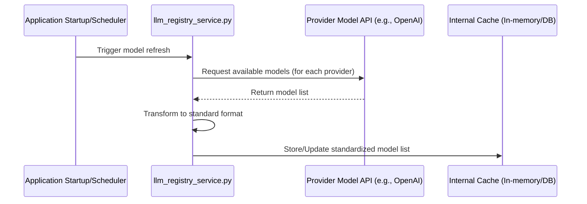
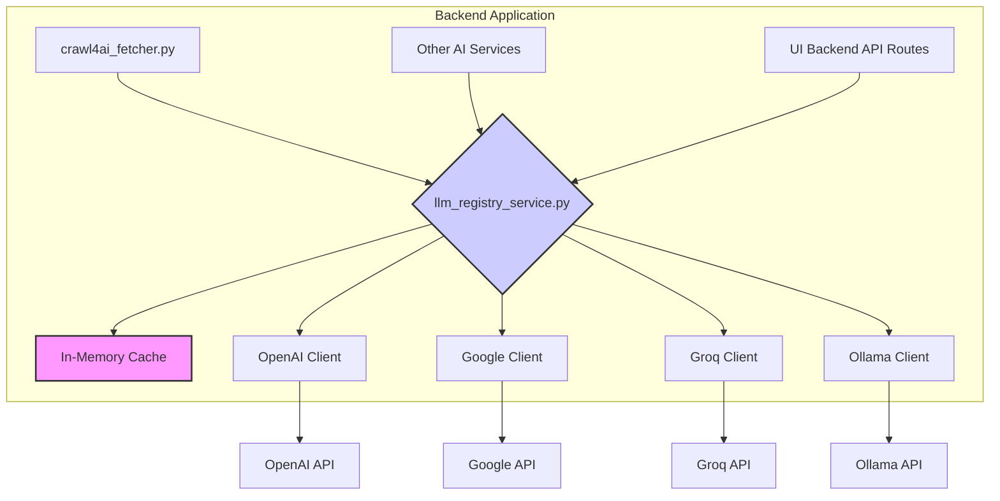

# Plan: Centralized LLM Model Management System

## 1. Objective

*   Develop a centralized service within the backend (`backend/app/`) to dynamically discover, store, and provide lists of available LLM models from multiple providers (OpenAI, Google/Gemini, Groq, Ollama, and others as needed).
*   Enable any part of the application (including `crawl4ai_fetcher.py`, custom analysis tools, future AI features, and UI backends) to access this curated list of models.
*   Allow for easy configuration and expansion to new providers in the future.

## 2. Research Phase

For each target provider (OpenAI, Google/Gemini, Groq, Ollama), and any other identified providers:

*   **Identify API Endpoints:**
    *   **OpenAI:** Research `https://api.openai.com/v1/models` (GET request).
    *   **Google/Gemini:** Investigate the relevant Gemini API for listing models (e.g., via Google AI Studio or `generativelanguage.googleapis.com`).
    *   **Groq:** Check GroqCloud API documentation for a model listing endpoint. If not available, consider if `crawl4ai` or other libraries used with Groq have ways to infer available models or if a static list is the only option.
    *   **Ollama:** For local Ollama instances, the API endpoint is typically `http://localhost:11434/api/tags` (GET request) to list locally pulled models. Consider how to handle multiple Ollama instances if applicable.
*   **Authentication Requirements:**
    *   Determine if the API keys used for inference are also sufficient for listing models.
    *   Note if separate keys or different permission scopes are needed (e.g., a read-only key for model listing).
*   **Data Structure of Response:**
    *   Analyze the JSON response for each provider. Key fields to look for:
        *   Model ID (e.g., `gpt-4-turbo-preview`, `gemini-pro`, `llama2-70b-4096`, `mistral:7b`)
        *   Model family/owner (e.g., `openai`, `google`, `meta`, `mistralai`)
        *   Capabilities (e.g., text generation, vision, chat, fine-tuning support)
        *   Context window size
        *   Pricing information (if available and relevant)
        *   Creation date/update date
*   **`crawl4ai` Compatibility:**
    *   Investigate if [`crawl4ai`](backend/app/crawl4ai_fetcher.py) has specific expectations for model ID formats (e.g., `openai/gpt-4-turbo-preview` vs. `gpt-4-turbo-preview`). This will inform the `crawl4ai_compatible_id` in our standardized format.
    *   Check `crawl4ai` documentation or source code for how it handles model selection.

## 3. Design Phase

### 3.1. Central Model Registry/Service

*   **New Module:** Create a new Python module: [`backend/app/llm_registry_service.py`](backend/app/llm_registry_service.py).
*   **Responsibilities:**
    *   Fetching model lists from configured providers.
    *   Transforming provider-specific model data into a standardized internal format.
    *   Caching the model lists.
    *   Providing an interface for other application components to access the model lists.
*   **Triggering Updates:**
    *   **On Application Startup:** Fetch models when the FastAPI application starts. This ensures fresh data is available immediately.
    *   **Periodically (Scheduled Task):** Implement a background task (e.g., using `FastAPI BackgroundTasks` or a library like `APScheduler`) to refresh the model list (e.g., every 6-24 hours). This keeps the list up-to-date without requiring an application restart.
    *   **On-Demand (Optional):** Consider an internal API endpoint (e.g., `/admin/refresh-models`) for manual triggering if needed for debugging or immediate updates.



### 3.2. Data Storage & Caching

*   **Storage Mechanism:**
    *   **In-Memory Cache with TTL (Time-To-Live):** Simplest approach for initial implementation. Store the list as a Python dictionary or list of objects in memory.
        *   Pros: Fast access, no external dependencies for storage.
        *   Cons: Data lost on restart if not fetched at startup, not shared across multiple worker processes (if applicable, though less common with Uvicorn default).
    *   **Simple Database Table (e.g., in Supabase):**
        *   Pros: Persistent, shared across processes/instances, can be queried.
        *   Cons: Adds DB dependency, slower than in-memory.
    *   **File-based Cache (JSON/Pickle):**
        *   Pros: Persistent, simple.
        *   Cons: File I/O overhead, concurrency management if written frequently.
    *   **Recommendation:** Start with an in-memory cache, populated at startup and refreshed periodically. This balances simplicity and performance. If persistence across restarts *before* the first fetch becomes critical, or if scaling to multiple instances is a near-term goal, then a database solution can be considered.
*   **Standardized Internal Model Format:** Define a Pydantic model or a simple dictionary structure:
    ```python
    # Example Pydantic model (in llm_registry_service.py or a shared models file)
    from typing import Optional, List, Dict
    from pydantic import BaseModel

    class ModelCapability(BaseModel):
        # e.g., "text_generation", "vision_input", "chat_completion"
        type: str
        # e.g., max_output_tokens, supported_mime_types
        details: Optional[Dict] = None

    class StandardizedLLM(BaseModel):
        provider: str  # e.g., "openai", "google", "groq", "ollama"
        model_id: str  # Provider's original model ID
        display_name: str # User-friendly name, can be same as model_id or enhanced
        # ID format expected by crawl4ai, if different from model_id
        crawl4ai_compatible_id: Optional[str] = None
        # ID format expected by other key internal tools, if different
        # internal_tool_compatible_id: Optional[str] = None
        family: Optional[str] = None # e.g., "gpt-4", "gemini", "llama2"
        context_window: Optional[int] = None
        # List of capabilities
        capabilities: List[ModelCapability] = []
        # e.g., "active", "deprecated"
        status: Optional[str] = "active"
        # When this model info was last fetched/updated
        last_updated: str # ISO 8601 timestamp
        # Any other relevant metadata
        additional_metadata: Optional[Dict] = None
        # For Ollama, path/URL if multiple instances
        # ollama_instance_url: Optional[str] = None
    ```

### 3.3. Integration with Existing Configuration ([`config.py`](backend/app/config.py))

*   The current static `AVAILABLE_MODELS` in [`config.py`](backend/app/config.py) (assuming its existence and structure) needs a strategy.
*   **Option C (Hybrid Approach - Recommended):**
    *   The dynamic list fetched by `llm_registry_service.py` becomes the **primary source** for model selection in UIs and most application logic.
    *   [`config.py`](backend/app/config.py) can hold:
        *   A small, static list of **essential/bootstrap models** (e.g., a default OpenAI model, a default Groq model) that can be used if the dynamic fetching fails entirely at startup.
        *   Configuration for which providers to query (e.g., `ENABLED_LLM_PROVIDERS = ["openai", "ollama"]`).
        *   Default API endpoint URLs for providers if they need to be configurable.
    *   This provides robustness (fallback) and dynamic updates. The static list in `config.py` would be a subset or a fallback, not the source of truth for available models.

### 3.4. API Key Management for Model Listing

*   API keys required for listing models should be sourced from environment variables.
*   Follow existing patterns in [`config.py`](backend/app/config.py) or [`backend/app/config/`](backend/app/config) for loading environment variables.
*   If listing keys are different from inference keys:
    *   Define new environment variable names (e.g., `OPENAI_MODEL_LIST_KEY`, `GOOGLE_MODEL_LIST_KEY`).
    *   If they are the same, the existing inference keys (e.g., `OPENAI_API_KEY`) can be reused by the `llm_registry_service.py`. This needs to be verified during the Research Phase.
*   For Ollama, if it's a local instance, an API key is typically not required for `/api/tags`. Configuration might involve the Ollama instance URL(s).

### 3.5. Application Access Interface

*   `llm_registry_service.py` will expose functions to access the cached model list.
    ```python
    # In backend/app/llm_registry_service.py

    _cached_models: List[StandardizedLLM] = []
    _cache_lock = asyncio.Lock() # For async safety if needed

    async def refresh_available_models():
        """Fetches models from all enabled providers and updates the cache."""
        # ... logic to call provider-specific fetchers ...
        # ... transform and update _cached_models ...
        pass

    def get_available_models(
        provider_filter: Optional[str] = None,
        capability_filter: Optional[str] = None # e.g., "vision_input"
    ) -> List[StandardizedLLM]:
        """
        Returns a list of available standardized LLM models.
        Optionally filters by provider or capability.
        """
        # Access _cached_models (consider thread/async safety if updated concurrently)
        models_to_return = _cached_models
        if provider_filter:
            models_to_return = [m for m in models_to_return if m.provider == provider_filter]
        if capability_filter:
            models_to_return = [
                m for m in models_to_return
                if any(cap.type == capability_filter for cap in m.capabilities)
            ]
        return models_to_return

    def get_model_details(provider: str, model_id: str) -> Optional[StandardizedLLM]:
        """Returns details for a specific model."""
        for model in _cached_models:
            if model.provider == provider and model.model_id == model_id:
                return model
        return None
    ```
*   Other modules like [`crawl4ai_fetcher.py`](backend/app/crawl4ai_fetcher.py) will import and use these functions.



### 3.6. Error Handling

*   **Provider API Errors:**
    *   Implement try-except blocks for each provider's API call.
    *   Log errors (unavailable service, authentication failure, rate limits, unexpected response format).
    *   If a provider fails, the system should continue to fetch from other providers.
    *   The `StandardizedLLM` object could include an error field or the service could maintain a list of providers that failed the last refresh.
*   **Fallback Mechanisms:**
    *   If dynamic fetching fails for a provider, use the last known good cache for that provider (if available).
    *   If all providers fail at startup and no cache exists, use the static bootstrap/default list from [`config.py`](backend/app/config.py).
    *   The `get_available_models()` function should clearly indicate if the returned list is stale or a fallback.

### 3.7. Model Identifier Normalization

*   The transformation step within `llm_registry_service.py` is crucial.
*   It must ensure that `model_id` is the provider's canonical ID.
*   It must populate `crawl4ai_compatible_id` correctly if `crawl4ai` expects a different format (e.g., `openai/gpt-4` vs `gpt-4`). This requires findings from the Research Phase.
*   The `display_name` can be made more user-friendly (e.g., "OpenAI GPT-4 Turbo" from `gpt-4-turbo-preview`).

## 4. Implementation Phase (High-Level Steps)

1.  **Setup `llm_registry_service.py`:**
    *   Create [`backend/app/llm_registry_service.py`](backend/app/llm_registry_service.py).
    *   Define the `StandardizedLLM` Pydantic model.
    *   Implement the basic caching structure (e.g., `_cached_models` list) and access functions (`get_available_models`, `get_model_details`).
2.  **Implement Provider Clients:**
    *   For each provider (OpenAI, Ollama first, then others):
        *   Create a function within `llm_registry_service.py` (e.g., `_fetch_openai_models()`, `_fetch_ollama_models()`).
        *   These functions will use `httpx` or the provider's Python SDK to call the model-listing API.
        *   Handle authentication.
        *   Transform the provider's response into a list of `StandardizedLLM` objects.
        *   Implement error handling for API calls.
3.  **Implement Core Refresh Logic:**
    *   Create the `refresh_available_models()` function to orchestrate calls to individual provider fetchers and update the central cache.
4.  **Integrate with Application Lifecycle:**
    *   Call `refresh_available_models()` on FastAPI application startup (e.g., in `main.py`'s `startup` event).
    *   Implement a periodic refresh mechanism (e.g., `BackgroundTasks` or `APScheduler`).
5.  **Update `config.py`:**
    *   Modify/define how API keys for model listing are loaded.
    *   Define the list of enabled providers.
    *   Establish the fallback/bootstrap model list.
6.  **Update Consumers:**
    *   Modify [`crawl4ai_fetcher.py`](backend/app/crawl4ai_fetcher.py):
        *   Import `get_available_models` from `llm_registry_service.py`.
        *   Use it to populate model selection options or validate model strings.
        *   Ensure it uses the `crawl4ai_compatible_id` if necessary.
    *   Identify and update other LLM-using modules similarly.
7.  **Testing:**
    *   Unit tests for provider client functions (mocking API calls).
    *   Unit tests for transformation logic.
    *   Integration tests for the `refresh_available_models()` and `get_available_models()` flow.
8.  **(Future) UI Integration:**
    *   Update/create backend API endpoints that call `get_available_models()` to provide the list to the frontend for dynamic dropdowns.
    *   Frontend components in `src/components/` would then consume these endpoints.

## 5. Documentation

*   **README Section or New Markdown File (e.g., `docs/llm_model_management.md`):**
    *   **Configuration:**
        *   How to set environment variables for each provider's model-listing API key (e.g., `OPENAI_API_KEY`, `OLLAMA_BASE_URL`).
        *   How to enable/disable providers in the application configuration.
    *   **Mechanism:**
        *   Overview of how dynamic model fetching and caching works (startup, periodic refresh).
        *   Error handling and fallback strategies.
    *   **Usage:**
        *   How other backend modules can consume `get_available_models()` and `get_model_details()`.
        *   Example usage.
    *   **Standard Model Format:**
        *   Detailed description of the `StandardizedLLM` fields.
    *   **Adding New Providers:**
        *   Steps required to add support for a new LLM provider (creating a new fetch function, updating configurations).

## 6. Considerations

*   **API Rate Limits:** Model-listing endpoints are generally not called as frequently as inference endpoints, but be mindful of potential rate limits, especially during development or if refresh intervals are very short. Implement respectful retry logic if needed.
*   **Security of API Keys:** Ensure API keys are handled securely, loaded from environment variables, and never committed to the repository. Use the principle of least privilege if model-listing keys can have restricted permissions.
*   **Performance:**
    *   Fetching from multiple providers can take time. Perform these operations asynchronously if possible (FastAPI handles async routes well; `httpx` is an async-first HTTP client).
    *   The in-memory cache should provide fast lookups.
*   **Extensibility (Adding New Providers):** The design should make it straightforward to add a new provider by:
    1.  Implementing a new `_fetch_<provider>_models()` function.
    2.  Adding the provider to the list of enabled providers in the configuration.
    3.  Ensuring its API key/config is handled.
*   **Ollama Specifics:** If multiple Ollama instances are possible (e.g., local dev, a shared remote one), the configuration needs to allow specifying Ollama base URLs. The `StandardizedLLM` might need a field to indicate which Ollama instance a model belongs to if this becomes complex. For a single, local instance, `http://localhost:11434` is usually standard.
*   **Consistency with `crawl4ai`:** The interaction with `crawl4ai` is key. If `crawl4ai` itself has a robust way of listing models for its supported providers, leverage that where possible instead of re-implementing the wheel, though a central cache is still beneficial. The research phase should clarify this.

## 7. Detailed Research Steps Outline

This section provides a more granular breakdown of the research activities required, expanding on the initial points in Section 2.

**I. Core System Components Identification & Refinement**

*   **A. `llm_registry_service.py` Module:**
    *   Confirm and detail the precise responsibilities:
        *   Fetching model lists from all configured providers.
        *   Transforming diverse provider-specific model data into the `StandardizedLLM` format.
        *   Implementing and managing the caching mechanism for model lists.
        *   Defining and providing a clear access interface (e.g., `get_available_models()`, `get_model_details()`) for other application components.
*   **B. Provider-Specific Clients/Fetchers:**
    *   Outline the research required for developing individual client logic within `llm_registry_service.py` for each targeted provider:
        *   OpenAI
        *   Google/Gemini
        *   Groq
        *   Ollama
        *   (Consider a placeholder for "Other future providers" to ensure extensibility in research).
*   **C. Caching Strategy:**
    *   Initial research focus: In-memory caching (as recommended in the plan).
        *   Evaluate simplicity, performance implications, and TTL (Time-To-Live) management.
    *   Secondary research: Briefly investigate alternatives for potential future scalability or persistence requirements:
        *   Simple database table (e.g., in Supabase, as mentioned in the plan).
        *   File-based cache (JSON/Pickle).
*   **D. Configuration Management Integration:**
    *   Research how API keys for model listing will be securely sourced (environment variables via [`backend/app/config.py`](backend/app/config.py)).
    *   Determine how provider enablement/disablement will be configured (e.g., a list in [`backend/app/config.py`](backend/app/config.py)).
    *   Plan for storing default API endpoint URLs if they need to be configurable.

**II. Provider-Specific API Research (Detailed Investigation)**

*   For each provider (OpenAI, Google/Gemini, Groq, Ollama):
    *   **1. API Endpoint for Model Listing:**
        *   Verify the exact GET endpoint URL (e.g., OpenAI: `https://api.openai.com/v1/models`, Ollama: `http://localhost:11434/api/tags`).
        *   For Groq and Google/Gemini, confirm the official endpoints or best methods for discovery.
    *   **2. Authentication Requirements:**
        *   Confirm if existing inference API keys are sufficient for model listing.
        *   Identify if separate keys, different permission scopes, or specific authentication headers are needed.
    *   **3. Request/Response Structure Analysis:**
        *   Make sample API calls (if feasible with available credentials/public endpoints) or thoroughly review API documentation.
        *   Analyze the JSON response structure to identify key fields for mapping to `StandardizedLLM`:
            *   Model ID (provider's canonical ID)
            *   Model family/owner
            *   Capabilities (text, vision, chat, etc.)
            *   Context window size
            *   Pricing information (if available and relevant)
            *   Creation/update dates
            *   Any other distinguishing metadata.
    *   **4. SDKs vs. Direct HTTP Calls:**
        *   Evaluate the benefits/drawbacks of using official Python SDKs (if available and suitable for model listing) versus direct HTTP calls using a library like `httpx`. Consider dependencies, maintenance, and ease of extracting required data.
    *   **5. Rate Limits & Quotas:**
        *   Research and document any rate limits or quotas specifically applicable to the model listing endpoints to inform refresh strategies.

**III. Data Model Definition (`StandardizedLLM`)**

*   **A. Review and Refine Proposed Pydantic Model:**
    *   Thoroughly examine the `StandardizedLLM` and `ModelCapability` Pydantic models proposed in [`docs/pmoves_dynamic_llm_plan.md`](docs/pmoves_dynamic_llm_plan.md:75-107).
*   **B. Map Provider Data to `StandardizedLLM`:**
    *   Based on findings from Provider-Specific API Research (II.3), ensure the `StandardizedLLM` model can accurately and comprehensively store data from all providers.
    *   Confirm all necessary fields are present and appropriately typed (e.g., `provider`, `model_id`, `display_name`, `crawl4ai_compatible_id`, `family`, `context_window`, `capabilities`, `status`, `last_updated`, `additional_metadata`).
    *   Refine the `ModelCapability` structure – determine if `type: str` and `details: Optional[Dict]` is sufficient or if more specific capability fields are needed.
    *   Address provider-specific nuances (e.g., `ollama_instance_url` for Ollama).
*   **C. Define Representation of Capabilities:**
    *   Decide on the best way to represent model capabilities (e.g., a list of predefined string constants, an Enum, or more structured objects within `ModelCapability.details`).

**IV. Library & Framework Evaluation**

*   **A. HTTP Client:**
    *   Confirm `httpx` as the preferred library for making asynchronous HTTP requests to provider APIs, aligning with FastAPI's async nature.
*   **B. Scheduling Mechanism for Periodic Refreshes:**
    *   `FastAPI BackgroundTasks`: Evaluate for simple, in-process periodic refreshes.
    *   `APScheduler` (or similar): Research if more complex scheduling (e.g., cron-like expressions, persistent job stores if moving beyond in-memory cache) is anticipated.
*   **C. Caching Libraries (for advanced in-memory caching):**
    *   If more sophisticated in-memory caching is desired (e.g., max size, eviction policies beyond simple TTL), research lightweight Python caching libraries like `cachetools`.
*   **D. `crawl4ai` Interaction and Compatibility:**
    *   **1. In-depth Analysis of [`backend/app/crawl4ai_fetcher.py`](backend/app/crawl4ai_fetcher.py):**
        *   Understand its current methods for model selection and configuration.
        *   Identify how it currently receives or defines model IDs.
    *   **2. Determine `crawl4ai_compatible_id` Format:**
        *   Precisely define the model ID string format expected by `crawl4ai` (e.g., `openai/gpt-4-turbo` vs. `gpt-4-turbo`). This is critical for the transformation step.
    *   **3. Leverage Existing `crawl4ai` Capabilities:**
        *   Investigate if `crawl4ai` itself offers any model listing functionalities for its supported providers that could be leveraged or integrated, rather than entirely re-implementing discovery for those specific cases.

**V. Identification of Impacted Codebase Areas & Integration Points**

*   **A. New Module:**
    *   [`backend/app/llm_registry_service.py`](backend/app/llm_registry_service.py): This will be the central new component.
*   **B. Configuration Files:**
    *   [`backend/app/config.py`](backend/app/config.py) (and potentially `.env` files):
        *   Storing and loading API keys/credentials for model listing.
        *   Defining the list of `ENABLED_LLM_PROVIDERS`.
        *   Storing fallback/bootstrap model lists as per Option C in the plan.
        *   Storing configurable provider API endpoint URLs.
*   **C. Key Consumer Modules:**
    *   [`backend/app/crawl4ai_fetcher.py`](backend/app/crawl4ai_fetcher.py):
        *   Modify to import and use `get_available_models()` from the new service.
        *   Adapt logic to use the `StandardizedLLM.crawl4ai_compatible_id` field.
        *   Potentially refactor existing model handling logic.
*   **D. Application Lifecycle Management:**
    *   [`backend/app/main.py`](backend/app/main.py):
        *   Integrate the call to `refresh_available_models()` during FastAPI application startup events.
        *   Set up and manage the chosen periodic refresh mechanism (e.g., `BackgroundTasks`, `APScheduler`).
*   **E. Other Potential Consumers (to be identified/confirmed):**
    *   Any existing or future custom data analysis tools that utilize LLMs.
    *   Future AI-powered features within the application.
    *   Backend API routes that will serve the model list to the frontend UI (e.g., for dynamic dropdowns in `src/components/`).

**VI. Potential Challenges & Mitigation Strategy Research (Proactive Problem Solving)**

*   **A. API Inconsistencies Across Providers:**
    *   Research: Anticipate variations in API stability, response data structures, and error reporting.
    *   Mitigation Strategy: Design robust, provider-specific transformation logic and error handling within each fetcher function.
*   **B. Authentication Complexity:**
    *   Research: Different providers might have unique authentication schemes or key scope requirements for model listing vs. inference.
    *   Mitigation Strategy: Ensure clear documentation for setting up API keys and flexible configuration in `config.py`.
*   **C. Rate Limiting on Listing Endpoints:**
    *   Research: Confirm if listing endpoints have stricter or different rate limits than inference.
    *   Mitigation Strategy: Implement configurable refresh intervals, respectful polling, and potentially basic backoff/retry logic in fetchers.
*   **D. Extensibility for New/Unsupported Providers:**
    *   Research: How easily can the system be extended?
    *   Mitigation Strategy: Adhere to the extensible design principles in the plan (e.g., dedicated fetch functions per provider, configuration-driven enablement).
*   **E. Ollama Instance Management:**
    *   Research: Scenarios involving multiple local/remote Ollama instances.
    *   Mitigation Strategy: Confirm the need and design for configurable Ollama base URLs and potentially associating models with specific instances in `StandardizedLLM`.
*   **F. Ensuring `crawl4ai` Compatibility:**
    *   Research: The criticality of the `crawl4ai_compatible_id`.
    *   Mitigation Strategy: Plan for thorough testing of `crawl4ai` integration after implementation, focusing on model ID formats.
*   **G. Data Staleness vs. API Load Performance:**
    *   Research: The trade-offs between frequent updates and API call overhead.
    *   Mitigation Strategy: Make cache TTL and refresh intervals configurable. Consider if an on-demand refresh API endpoint is valuable.
*   **H. Comprehensive Error Handling & Fallbacks:**
    *   Research: How the system should behave when providers are unavailable or APIs fail.
    *   Mitigation Strategy: Plan to implement the fallback mechanisms detailed in Section 3.6 of the plan (using last good cache, bootstrap list from `config.py`).

**VII. Deliverables for the Research Phase (Expected Outcomes)**

*   A consolidated document or report detailing:
    *   Findings for each provider API (endpoints, auth, data structures, rate limits).
    *   The finalized Pydantic model definition for `StandardizedLLM` and `ModelCapability`.
    *   Recommendations for chosen libraries/frameworks (HTTP client, scheduler, caching).
    *   A detailed plan for integration with [`backend/app/crawl4ai_fetcher.py`](backend/app/crawl4ai_fetcher.py) and other key modules.
    *   A summary of identified challenges and more detailed proposed solutions/mitigation strategies.
    *   Clear definition of `crawl4ai_compatible_id` format.