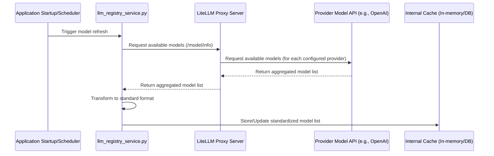

# Super Plan: Centralized LLM Model Management System with LiteLLM and Integrated Agents

## 1. Objective

*   Develop a robust and centralized service within the backend (`backend/app/`) that leverages a LiteLLM proxy server to dynamically discover, store, and provide a standardized list of available LLM models from multiple providers (OpenAI, Google/Gemini, Groq, Ollama, and others configured in LiteLLM).
*   Enable any part of the application (including `crawl4ai_fetcher.py`, custom analysis tools, future AI features, UI backends, and **newly introduced agents**) to access this curated and up-to-date list of models via a consistent internal interface.
*   Ensure easy configuration, scalability, and expansion to new providers by managing provider integrations primarily within the LiteLLM proxy.
*   **Introduce a framework for developing LLM-powered agents within the application, including a specialized Supabase agent.**
*   **Integrate dynamic LLM model selection and relevant model information into the frontend UI.**

## 2. Research Phase

This phase focuses on understanding and configuring the LiteLLM proxy and its interaction with various providers, as well as exploring potential agent frameworks.

*   **LiteLLM Proxy Setup and Configuration:**
    *   Research the installation process for LiteLLM with proxy support (`pip install 'litellm[proxy]'`).
    *   Investigate the structure and options of the LiteLLM `config.yaml` file, including the use of the `include` directive for modularity.
    *   Determine how to add and configure various LLM providers (OpenAI, Google/Gemini, Groq, Ollama, etc.) within the `config.yaml`, emphasizing the use of environment variables for API keys and sensitive information.
    *   Understand how to enable the model discovery feature (`check_provider_endpoint: true`) in the LiteLLM configuration.
    *   Research options for securing the LiteLLM proxy (e.g., API keys, JWT, master key) and how your backend application will authenticate with the proxy.
*   **LiteLLM `/model/info` Endpoint Analysis:**
    *   Analyze the expected JSON response structure from the LiteLLM proxy's `/model/info` endpoint. This endpoint provides more detailed model information, including context window and capabilities within the `model_info` field.
    *   Identify key fields provided for each model (e.g., `model_name`, `litellm_params`, `model_info` containing `max_tokens`, `mode`, `litellm_provider`) and how they map to the requirements of the `StandardizedLLM` format.
    *   Determine if additional model details (pricing) are available through this endpoint or require separate mechanisms.
*   **`crawl4ai` Compatibility:**
    *   Investigate if [`crawl4ai`](backend/app/crawl4ai_fetcher.py) has specific expectations for model ID formats (e.g., `openai/gpt-4-turbo-preview` vs. `gpt-4-turbo-preview`).
    *   Check `crawl4ai` documentation or source code for how it handles model selection and if it can directly use the model IDs provided by the LiteLLM proxy. This will inform the `crawl4ai_compatible_id` in our standardized format.
*   **Agent Framework Research (Optional Initial Step):**
    *   Explore existing Python agent frameworks (e.g., LangChain Agents, LlamaIndex Agents) to see if they offer suitable structures or components for building agents that interact with LLMs and external services.
    *   Evaluate if a custom, simpler agent framework is more appropriate for the initial implementation.

## 3. Design Phase

### 3.1. Central Model Registry/Service (`llm_registry_service.py`)

*   **Module:** [`backend/app/llm_registry_service.py`](backend/app/llm_registry_service.py).
*   **Responsibilities:**
    *   Calling the LiteLLM proxy's `/model/info` endpoint to fetch the list of available models and their details.
    *   Handling authentication with the LiteLLM proxy.
    *   Transforming the LiteLLM proxy's response into the standardized internal `StandardizedLLM` format.
    *   Implementing and managing the caching mechanism for the model list.
    *   Providing a consistent and easy-to-use interface (`get_available_models`, `get_model_details`) for other application components (including agents) to access the cached model list.
*   **Triggering Updates:**
    *   **On Application Startup:** Fetch models from the LiteLLM proxy when the FastAPI application starts to ensure initial data availability.
    *   **Periodically (Scheduled Task):** Implement a background task (e.g., using `FastAPI BackgroundTasks` or `APScheduler`) to refresh the model list from the LiteLLM proxy at a configurable interval (e.g., every 6-24 hours).
    *   **On-Demand (Optional):** Consider an internal API endpoint (e.g., `/admin/refresh-models`) for manual triggering for debugging or immediate updates.



### 3.2. Data Storage & Caching

*   **Storage Mechanism:**
    *   **In-Memory Cache with TTL (Time-To-Live):** Simple and fast for initial implementation.
        *   Pros: Fast access, no external dependencies for storage.
        *   Cons: Data lost on restart if not fetched at startup, not shared across multiple worker processes.
    *   **Simple Database Table (e.g., in Supabase):** Provides persistence across restarts and can be shared across multiple instances.
        *   Pros: Persistent, shared, can be queried.
        *   Cons: Adds DB dependency, potentially slower than in-memory.
    *   **File-based Cache (JSON/Pickle):** Persistent and simple, but requires careful handling of concurrency.
        *   Pros: Persistent, simple.
        *   Cons: File I/O overhead, concurrency management.
    *   **Recommendation:** Start with an in-memory cache populated at startup and refreshed periodically. For enhanced robustness and scalability, plan to migrate to a database-backed cache (e.g., a dedicated table in Supabase) in a future iteration.
*   **Standardized Internal Model Format:** Refine the Pydantic model based on the LiteLLM `/model/info` response and required internal fields:
    ```python
    # Example Pydantic model (in llm_registry_service.py or a shared models file)
    from typing import Optional, List, Dict
    from pydantic import BaseModel, Field
    from datetime import datetime

    class ModelCapability(BaseModel):
        type: str # e.g., "text_generation", "vision_input", "chat_completion"
        details: Optional[Dict] = None # e.g., max_output_tokens, supported_mime_types

    class StandardizedLLM(BaseModel):
        provider: str  # e.g., "openai", "google", "groq", "ollama" (derived from LiteLLM response or config)
        model_id: str  # Provider's original model ID (from LiteLLM response 'id')
        display_name: str # User-friendly name, can be same as model_id or enhanced
        crawl4ai_compatible_id: Optional[str] = None # ID format expected by crawl4ai, if different
        family: Optional[str] = None # e.g., "gpt-4", "gemini", "llama2" (can be derived or added)
        context_window: Optional[int] = None # Can be added if available or estimated
        capabilities: List[ModelCapability] = Field(default_factory=list) # List of capabilities
        status: Optional[str] = "active" # e.g., "active", "deprecated" (can be derived or added)
        last_updated: datetime = Field(default_factory=datetime.utcnow) # When this model info was last fetched/updated
        additional_metadata: Optional[Dict] = None # Any other relevant metadata from LiteLLM response

        # Add fields for potential future enhancements or provider-specific details
        pricing: Optional[Dict] = None # If pricing info can be obtained
        rate_limits: Optional[Dict] = None # If rate limit info can be obtained
        # For Ollama, path/URL if multiple instances (if LiteLLM exposes this)
        # ollama_instance_url: Optional[str] = None
    ```

### 3.3. Integration with Existing Configuration (`app_config.py`)

*   [`app_config.py`](backend/app/app_config.py) will manage configuration related to the LiteLLM proxy and the LLM registry service.
*   **LiteLLM Proxy Configuration:**
    *   `LITELLM_PROXY_URL`: The base URL of the running LiteLLM proxy server.
    *   `LITELLM_PROXY_API_KEY` (Optional): API key for authenticating with the LiteLLM proxy if secured.
*   **LLM Registry Service Configuration:**
    *   `LLM_REFRESH_INTERVAL_SECONDS`: How often the model list should be refreshed from the LiteLLM proxy.
    *   `LLM_CACHE_TTL_SECONDS`: Time-to-live for the in-memory cache.
    *   `FALLBACK_MODELS`: A small, static list of essential/bootstrap models to use if fetching from the LiteLLM proxy fails entirely at startup and no cache is available.
*   Follow existing patterns in [`app_config.py`](backend/app/app_config.py) for loading environment variables.

### 3.4. API Key Management

*   API keys for individual LLM providers (OpenAI, Groq, etc.) will be managed within the LiteLLM proxy's `config.yaml` or environment variables where the proxy is running. **Environment variables are the recommended and most secure approach, especially in a Dockerized deployment.**
*   Your backend application's `app_config.py` will only need the `LITELLM_PROXY_API_KEY` if the proxy is secured.

### 3.5. Application Access Interface

*   `llm_registry_service.py` will expose the following functions:
    ```python
    # In backend/app/utils/llm_registry_service.py

    _cached_models: List[StandardizedLLM] = []
    _cache_timestamp: Optional[datetime] = None
    _cache_lock = asyncio.Lock() # For async safety

    async def refresh_available_models():
        """Fetches models from the LiteLLM proxy and updates the cache."""
        # ... logic to call LiteLLM proxy /model/info ...
        # ... transform response to _cached_models ...
        # ... update _cache_timestamp ...
        pass

    def get_available_models(
        provider_filter: Optional[str] = None,
        capability_filter: Optional[str] = None
    ) -> List[StandardizedLLM]:
        """
        Returns a list of available standardized LLM models from the cache.
        Optionally filters by provider or capability.
        """
        # Access _cached_models safely
        pass # ... implementation ...

    def get_model_details(provider: str, model_id: str) -> Optional[StandardizedLLM]:
        """Returns details for a specific model from the cache."""
        # Access _cached_models safely
        pass # ... implementation ...

    def get_cache_status() -> Dict:
        """Returns information about the current cache state (timestamp, number of models)."""
        pass # ... implementation ...

    # Add functions for making LLM calls via the registry
    async def generate_text(model_id: str, prompt: str, **kwargs):
        """Generates text using the specified model via the LiteLLM proxy."""
        pass # ... implementation ...

    async def generate_embedding(model_id: str, text: str):
        """Generates embeddings using the specified model via the LiteLLM proxy."""
        pass # ... implementation ...

    async def transcribe_audio(model_id: str, audio_data: bytes):
        """Transcribes audio using the specified model via the LiteLLM proxy."""
        pass # ... implementation ...

    async def analyze_with_vision(model_id: str, image_data: bytes, prompt: str):
        """Analyzes image with vision model via the LiteLLM proxy."""
        pass # ... implementation ...
    ```
*   Other modules like [`crawl4ai_fetcher.py`](backend/app/crawl4ai_fetcher.py) and **newly introduced agents** will import and use these functions.

```mermaid
graph TD
    subgraph Backend Application
        A[crawl4ai_fetcher.py] --> B{llm_registry_service.py};
        C[Other AI Services] --> B;
        D[UI Backend API Routes] --> B;
        E[LiteLLM-Powered Agents] --> B;
        B --> F[In-Memory Cache];
        B --> G[HTTP Client (httpx)];
    end
    G --> H[LiteLLM Proxy Server];
    H --> I[Various LLM Provider APIs];
    E --> J[Supabase Client (for Supabase Agent)];

    style B fill:#ccf,stroke:#333,stroke-width:2px;
    style F fill:#f9f,stroke:#333,stroke-width:2px;
    style H fill:#cfc,stroke:#333,stroke-width:2px;
    style E fill:#ffc,stroke:#333,stroke-width:2px;
    style J fill:#cff,stroke:#333,stroke-width:2px;
```

### 3.6. Error Handling

*   **LiteLLM Proxy Communication Errors:**
    *   Implement robust try-except blocks for HTTP calls to the LiteLLM proxy.
    *   Handle network errors, timeouts, and authentication failures.
    *   Log errors with sufficient detail.
*   **LiteLLM Proxy Response Errors:**
    *   Handle non-200 HTTP status codes from the proxy.
    *   Parse error messages returned by the proxy (e.g., if a specific provider is down or misconfigured in LiteLLM).
*   **Fallback Mechanisms:**
    *   If fetching from the LiteLLM proxy fails during a refresh, retain the last known good cached list.
    *   If fetching fails at startup and no cache exists, use the static `FALLBACK_MODELS` list from `app_config.py`.
    *   The `get_available_models()` function should provide a way (e.g., return value or logging) to indicate if the returned list is potentially stale or a fallback.
*   **Agent-Specific Error Handling:** Agents should implement error handling for LLM calls and any subsequent actions (e.g., Supabase interactions for the Supabase agent).
*   **Monitoring and Alerting:**
    *   Consider integrating monitoring for the LLM registry service (e.g., logging failed refresh attempts, cache staleness).
    *   If using a database cache, monitor database connection and query performance.
    *   Implement logging and monitoring for agent activity and failures.

### 3.7. Model Identifier Normalization and Enrichment

*   The transformation step in `llm_registry_service.py` will map the LiteLLM proxy's response format to the `StandardizedLLM` model.
*   Populate `provider`, `model_id`, and potentially `display_name` directly from the LiteLLM response.
*   Determine if `crawl4ai_compatible_id` is still needed based on `crawl4ai`'s compatibility with LiteLLM's model IDs.
*   Enrich the `StandardizedLLM` objects with additional information (e.g., `family`, `context_window`, `capabilities`, `status`, `pricing`, `rate_limits`) if this data can be:
    *   Obtained from the LiteLLM `/model/info` endpoint (specifically the `model_info` field).
    *   Inferred based on `model_id` using a local mapping or another source.
    *   Added manually to the LiteLLM `config.yaml` and potentially exposed by the proxy (research needed).
*   Define a clear strategy for representing model capabilities consistently across providers.

## 4. Frontend Integration and UI Improvements

This section outlines how the frontend will interact with the backend LLM registry and proposed UI enhancements.

1.  **Backend API Endpoint:** Create a new backend API endpoint (e.g., `/api/llm/models`) that calls `llm_registry_service.get_available_models()` and returns the standardized list of LLM models to the frontend. This endpoint can accept optional query parameters for filtering by provider or capability.
2.  **Frontend Service/Hook:** Implement a frontend service or a custom React hook (e.g., `useLLMModels`) that fetches data from the `/api/llm/models` endpoint. This hook should handle loading states, errors, and potentially caching the model list on the frontend to avoid excessive API calls.
3.  **Data Consumption:** Frontend components that require LLM model selection (e.g., on the Fetch page for LLM extraction, or potentially a future dedicated LLM interaction page or agent interface) will use this service/hook to get the list of models.
4.  **Dynamic Model Selection Dropdowns:** Use standard HTML select elements or a third-party React component for dynamic dropdowns, populated by the list from the backend registry. Style these using Tailwind CSS, potentially following Supabase's design principles, and use Supabase UI `Typography` for labels and options where appropriate for consistency.
5.  **Provider Grouping:** Implement grouping logic in the frontend to display models grouped by provider within the dropdown or selection interface.
6.  **Displaying Model Information:** When a user selects a model, display relevant information from the `StandardizedLLM` object using Supabase UI `Typography` components. Use Supabase UI `Icons` to visually represent capabilities.
7.  **Filtering and Sorting:** Implement filtering and sorting logic in the frontend using standard JavaScript/React techniques. UI controls can be built using basic HTML elements styled with Tailwind or potentially simple Supabase UI components like `Button` for filter toggles.
8.  **Loading and Error States:** Clearly indicate loading states and display error messages using Supabase UI `Typography` or a dedicated notification component if available and suitable (referencing the existing `use-toast.js` and `sonner.jsx`).
9.  **Context Window Indicator:** Display this information using Supabase UI `Typography`, potentially with color-coding or icons (from Supabase UI `Icons`) to indicate proximity to the limit.
10. **Capability-Based UI Adjustments:** Implement conditional rendering in React based on the selected model's capabilities. Basic UI elements can be styled with Tailwind or use simple Supabase UI components.
11. **"Model Details" Modal/Tooltip:** If a modal or tooltip is desired for more details, implement this using standard React practices or a different UI library, as a specific component for this wasn't evident in the Supabase UI snippets.

## 5. LiteLLM-Powered Agents

This section outlines the plan for developing agents within the application that utilize the centralized LLM registry.

1.  **Agent Framework/Structure:** Define a common structure or framework for creating agents within the application. This could involve:
    *   Defining agent responsibilities and capabilities.
    *   Establishing how agents receive instructions or triggers.
    *   Standardizing how agents interact with LLMs via the `llm_registry_service` (selecting models, making calls).
    *   Implementing mechanisms for agents to perform actions based on LLM outputs (e.g., calling other internal services, interacting with external APIs).
    *   Consider using or adapting an existing agent framework if beneficial, but prioritize a simple custom implementation initially if frameworks add unnecessary complexity.
2.  **Utilizing the LLM Registry:** Agents will be primary consumers of the `llm_registry_service`. They will use `get_available_models` to discover suitable models for their tasks based on required capabilities (e.g., text generation, function calling) and `get_model_details` to get information about selected models (like context window) to inform their operation and prompt construction.
3.  **Agent Types:** Identify potential types of agents that would be beneficial for the application. This could include:
    *   **Content Analysis Agent:** Uses LLMs to analyze fetched web content, potentially extracting key information, summarizing, or identifying topics.
    *   **Data Processing Agent:** Uses LLMs to process or transform data within the application.
    *   **User Interaction Agent:** Powers conversational interfaces or provides intelligent assistance to users.
    *   **Supabase Agent:** A specialized agent designed to interact with Supabase services using LLMs.

### 5.1. The Supabase Agent

This subsection details the concept and planned implementation of the Supabase agent.

1.  **Objective:** To create an agent that can understand natural language requests related to Supabase data and services and execute the corresponding actions or queries.
2.  **Responsibilities:** The Supabase agent could be responsible for tasks such as:
    *   Performing database queries (SELECT) based on user prompts, potentially translating natural language conditions into SQL or Supabase client method calls.
    *   Adding (INSERT), updating (UPDATE), or deleting (DELETE) data in Supabase tables based on instructions, with appropriate validation and permission checks.
    *   Managing user authentication or profiles (with appropriate permissions and security considerations).
    *   Interacting with Supabase Storage (uploading, downloading, or managing files) based on user requests.
3.  **Mechanism:** The Supabase agent would likely work by:
    *   Receiving a natural language instruction from a user or another system component.
    *   Using an LLM (via the `llm_registry_service`) to interpret the instruction, identify the target Supabase service/table, and determine the intended operation (e.g., query, insert, update). This step will heavily rely on prompt engineering and potentially the LLM's function calling capabilities, providing the LLM with descriptions of available Supabase interactions.
    *   Using the Supabase Python client library (`supabase-py`) to programmatically execute the determined operation against the Supabase backend.
    *   Handling the response from Supabase, including potential errors.
    *   Using an LLM again to format the results from Supabase into a user-friendly and understandable response for the user or calling component.
4.  **Integration:** The Supabase agent would be a backend component, potentially exposed via its own internal interface or API endpoint for use by other backend services or a dedicated frontend agent interface. It would rely on the `llm_registry_service` for LLM access and the Supabase client for database and service interaction. Secure handling of Supabase credentials within the agent is critical.

## 6. Implementation Phase (High-Level Steps)

1.  **Setup LiteLLM Proxy (Docker Deployment):**
    *   Status: COMPLETED
    *   The LiteLLM proxy server has been successfully deployed using Docker.
    *   The `docker run` command was updated to use `--env-file "c:/Users/russe/Documents/GitHub/PMOVES-transcribe-and-fetch/backend/app/.env"` (adjusted for PowerShell with backticks for line continuation) to securely pass API keys from the application's `.env` file to the proxy container. This simplifies API key management for the proxy.
    *   The proxy is running and accessible at `http://localhost:4000`.
    *   The `litellm_proxy_config/config.yaml` is mounted and being used by the proxy.
    *   Initial `config.yaml` in `litellm_proxy_config/` includes configurations for an OpenAI model (`gpt-4.1-mini-proxy`) and an Ollama model (`ollama-model-proxy`).
    *   **Enhancement:** Enabled raw request/response logging and configured the Supabase callback in `litellm_proxy_config/config.yaml`.
2.  **Setup `llm_registry_service.py`:**
    *   Status: COMPLETED (Initial Structure & Core Functionality)
    *   Created [`backend/app/utils/llm_registry_service.py`](backend/app/utils/llm_registry_service.py).
    *   Defined `StandardizedLLM` and `ModelCapability` Pydantic models.
    *   Implemented initial in-memory caching structure and function signatures.
    *   Configuration variables are imported from `app_config.py`.
    *   Error handling for `None` values in `model_info.mode` from proxy response has been added.
3.  **Implement LiteLLM Proxy Client:**
    *   Status: COMPLETED
    *   Within `llm_registry_service.py`, the `_fetch_models_from_litellm_proxy()` function successfully makes an `httpx` call to the LiteLLM proxy's `/model/info` endpoint.
    *   Parsing and transformation logic for the `/model/info` response is implemented.
    *   Task-specific functions (`generate_embedding`, `transcribe_audio`, `analyze_with_vision`, `generate_text`) are implemented to route calls through the LiteLLM proxy.
4.  **Implement Core Refresh Logic:**
    *   Status: COMPLETED
    *   The `refresh_available_models()` function in `llm_registry_service.py` successfully calls `_fetch_models_from_litellm_proxy()` and updates the in-memory cache.
5.  **Integrate with Application Lifecycle:**
    *   Status: COMPLETED
    *   Updated `backend/app/main.py` to correctly import and call `initialize_llm_registry` and `schedule_llm_registry_refresh` from `llm_registry_service.py` during application startup.
    *   Fixed various import errors and `NameError` issues in `app_config.py`, `llm_registry_service.py`, `crawl4ai_fetcher.py`, `psearchworking.py`, and `debug_endpoints.py` to ensure smooth startup.
6.  **Update `config.py` (actually `app_config.py`):**
    *   Status: COMPLETED
    *   Added configuration variables for `LITELLM_PROXY_URL`, `LITELLM_PROXY_API_KEY`, `LLM_REFRESH_INTERVAL_SECONDS`, `LLM_CACHE_TTL_SECONDS`, `FALLBACK_MODELS_JSON`, `DEFAULT_EMBEDDING_MODEL_ID`, `DEFAULT_ANALYSIS_MODEL_ID`, and `DEFAULT_TRANSCRIPTION_MODEL_ID` to `backend/app/app_config.py`.
    *   Ensured these are loaded from environment variables with defaults.
7.  **Update Consumers:**
    *   Status: COMPLETED (Initial Proxy Integration)
    *   **`crawl4ai_fetcher.py`**: Modified to use `llm_registry_service.get_model_details` for `LLMExtractionStrategy`'s `LLMConfig`, ensuring calls are routed via the proxy URL.
    *   **`psearchworking.py`**: Modified `ModelSelector.generate_analysis` to call `llm_registry_service.generate_text_from_registry`, routing calls via the proxy.
    *   **`transcribe1.py`**: Modified `process_video` to call `llm_registry_service.transcribe_audio_from_registry` for non-local models, routing via proxy.
    *   **`main.py` (Embeddings)**: The `get_embedding_with_registry` function now calls `llm_registry_service.generate_embedding`, routing via proxy.
    *   To Do: Further refinement of error handling and model capability usage in all consumers based on comprehensive testing. Integrate vision models.
8.  **Testing:**
    *   Status: IN PROGRESS
    *   **LiteLLM Proxy & Registry Service Interaction Tests:**
        *   Successfully started LiteLLM proxy using Docker with `--env-file` for API key management.
        *   Backend application starts successfully.
        *   `llm_registry_service` successfully fetches and caches models from the proxy's `/model/info` endpoint (verified via `/debug/llm-registry-status`).
        *   Test call to an OpenAI model (`openai/gpt-4.1-mini-2025-04-14`) via the `/debug/test-llm-via-registry` endpoint was **SUCCESSFUL**.
        *   Test call to a Groq model (`groq/llama3-70b-8192`) via the debug endpoint **FAILED** with a `400 Bad Request` from the proxy, indicating the proxy's `config.yaml` is not yet configured for this specific Groq model.
    *   **Next Steps for Testing:**
        *   Configure Groq (and other desired providers like Ollama, LLM Studio) in `litellm_proxy_config/config.yaml` (see Step 9).
        *   **Implement and execute tests specifically for the `llm_registry_service` to verify successful fetching and standardization of models from the LiteLLM proxy for each configured provider type (cloud and local) and specific providers (Groq, Google, Ollama, LLM Studio). These tests should confirm that the backend correctly receives and processes the model information from the proxy.**
        *   Retest Groq (and other providers) via the `/debug/test-llm-via-registry` endpoint.
        *   Perform end-to-end testing of features using these models (e.g., Crawl4AI LLM extraction, pSearch analysis).
    *   **Future Unit Tests:**
        *   Unit tests for the LiteLLM proxy client function (mocking HTTP responses).
        *   Unit tests for the transformation logic.
    *   Unit tests for the caching mechanism and access functions.
    *   Integration tests for the `refresh_available_models()` flow, including error and fallback scenarios.
    *   Integration tests for consumers (e.g., `crawl4ai_fetcher.py`) using the `llm_registry_service`.
9.  **Configure Providers in LiteLLM `config.yaml`:**
    *   Status: COMPLETED (Initial Configuration for Groq and Gemini 2.5 Flash)
    *   For each LLM provider (OpenAI, Groq, Ollama, etc.) intended to be used via the proxy, ensure they are correctly defined in `litellm_proxy_config/config.yaml`.
    *   This includes specifying the `model_name` (alias for the backend), `litellm_params.model` (actual provider model ID), `litellm_params.api_key` (e.g., `os.environ/PROVIDER_API_KEY`), and any other necessary provider-specific parameters (like `api_base` for Groq).
    *   **Action Item:** Review LiteLLM documentation for each provider (e.g., files in `docs/litellm/docs/my-website/docs/providers/`) to ensure robust and correct configuration. This is critical for models like Groq to work. The initial test for Groq failed due to missing configuration in `config.yaml`.
    *   **Update:** Added configuration for Groq (`groq/llama3-70b-8192`, `groq/llama3-8b-8192`) and Gemini 2.5 Flash (`gemini/gemini-2.5-flash-preview-04-17`) in `litellm_proxy_config/config.yaml`.
10. **Create `docker-compose.yml` for Simplified Setup:**
    *   Status: PENDING
    *   Develop a `docker-compose.yml` file to manage the LiteLLM proxy and backend services.
    *   This will simplify startup and ensure environment variables from `.env` are correctly passed to the LiteLLM proxy.
    *   Requires creating a `Dockerfile` for the backend application.
11. **Implement LiteLLM-Powered Agents:**
    *   Status: PENDING
    *   Develop the agent framework/structure as designed in Section 5.
    *   Implement specific agent types, starting with the **Supabase Agent**.
    *   Ensure agents correctly utilize the `llm_registry_service` for model access and interaction.
    *   Implement necessary logic for agents to perform actions based on LLM outputs (e.g., using the Supabase client library for the Supabase agent).
12. **Implement Frontend API Endpoint for Models:**
    *   Status: PENDING
    *   Create the `/api/llm/models` endpoint in the backend to expose the available models to the frontend.
13. **Implement Frontend Integration and UI:**
    *   Status: PENDING
    *   Develop the frontend service/hook (`useLLMModels`) to fetch models.
    *   Update relevant frontend components (e.g., Fetch page) to use the dynamic model list.
    *   Implement the proposed UI improvements for model selection and information display, using Supabase UI components for consistency where appropriate.
14. **(Future) Database Cache:**
    *   If needed, implement a database table for caching models and update the `llm_registry_service.py` to use the database instead of the in-memory cache.

## 7. Documentation

*   **New Markdown File (`docs/llm_model_management.md`):**
    *   **Overview:** Explain the architecture with the LiteLLM proxy, the `llm_registry_service`, and the agent framework.
    *   **LiteLLM Proxy Setup (Docker Focus):** Detailed instructions on installing LiteLLM with proxy support, configuring (`config.yaml` for providers, model discovery, security), and running the LiteLLM proxy using Docker. Include guidance on choosing the appropriate Docker image, mounting the config file, and securely passing environment variables (e.g., via `--env-file` or `docker-compose.yml`) for API keys and the master key. Explain how to use the `include` directive for organizing `config.yaml`.
    *   **Backend Configuration:** How to set environment variables for `LITELLM_PROXY_URL`, `LITELLM_PROXY_API_KEY`, `LLM_REFRESH_INTERVAL_SECONDS`, `LLM_CACHE_TTL_SECONDS`, and `FALLBACK_MODELS`.
    *   **Mechanism:**
        *   Detailed explanation of how the `llm_registry_service` fetches models from the LiteLLM proxy.
        *   Description of the caching mechanism (in-memory and future database).
        *   Error handling and fallback strategies.
    *   **Agent Framework:** Document the developed agent framework and how to create new agent types.
    *   **Supabase Agent:** Detail the functionality and usage of the Supabase agent.
    *   **Frontend Integration:** Explain how the frontend fetches and uses the model list and the implemented UI components.
    *   **Usage:**
        *   How other backend modules and agents can consume `get_available_models()` and `get_model_details()`.
        *   Example usage in Python.
    *   **Standard Model Format:** Detailed description of the `StandardizedLLM` fields and how they are populated from the LiteLLM proxy response.
    *   **Adding New Providers:** Steps required to add support for a new LLM provider (primarily involves configuring LiteLLM).
    *   **Monitoring:** How to monitor the LiteLLM proxy, the LLM registry service, and agent activity, including potential integration with tools like Prometheus and Grafana.

## 8. Considerations and Enhancements

*   **LiteLLM Proxy Security:** Implementing API key or JWT authentication for the LiteLLM proxy is highly recommended, especially in production environments. **Securely managing API keys and the LiteLLM master key using environment variables in Docker is crucial.**
*   **LiteLLM Proxy Scalability and High Availability:** For production, consider running multiple instances of the LiteLLM proxy and using a load balancer. **Utilizing Redis for sharing rate limits and other state across multiple LiteLLM instances is a key consideration for scalability.**
*   **Detailed Model Information:** The LiteLLM `/v1/models` endpoint might not provide all the details needed for the `StandardizedLLM` model (e.g., context window, specific capabilities). Research if LiteLLM offers other ways to retrieve this information or if it needs to be manually maintained or estimated. **ADDRESSED by using the `/model/info` endpoint, which provides `max_tokens` and `mode` in the `model_info` field.**
*   **Provider-Specific Nuances:** Be prepared to handle any provider-specific differences in model IDs or behavior that might affect the transformation to `StandardizedLLM` or compatibility with consumers like `crawl4ai` or agents.
*   **Monitoring and Alerting:** Set up monitoring for the LiteLLM proxy (e.g., using Prometheus and Grafana as suggested in LiteLLM docs) and integrate alerts for proxy downtime or errors in model discovery. Implement monitoring for agent performance and failures.
*   **Version Control for LiteLLM Config:** Manage the LiteLLM `config.yaml` under version control. **Consider how to manage the `config.yaml` file(s) in your Docker deployment, potentially using config maps in Kubernetes or mounting volumes in Docker Compose.**
*   **Automated LiteLLM Deployment:** Consider automating the deployment of the LiteLLM proxy alongside your backend application (e.g., using Docker Compose or Kubernetes).
*   **Graceful Degradation:** Ensure that if the LiteLLM proxy is unavailable, your application can still function using the cached model list or the fallback models. Agents should also handle LLM call failures gracefully.
*   **Testing Strategy:** Develop a comprehensive testing strategy that includes testing the LiteLLM proxy setup, the backend's interaction with the proxy, the caching mechanism, the agent framework, specific agent implementations (including the Supabase agent), and the frontend integration.
*   **Frontend Performance:** Consider the performance implications of fetching and rendering potentially large lists of models on the frontend. Implement pagination or virtualization if necessary.
*   **Frontend User Experience:** Ensure the UI for model selection and agent interaction is intuitive and easy to use. Provide clear feedback on loading states, errors, and agent progress.
*   **Supabase Agent Security:** Implementing robust security measures for the Supabase agent is paramount. This includes proper authentication and authorization to ensure the agent can only perform actions permitted by the user or the system. Avoid exposing sensitive Supabase credentials directly to the agent's prompt or LLM.

## 9. Detailed Research Steps Outline (Revised)

This section provides a more granular breakdown of the research activities required, focusing on the LiteLLM integration and agent development.

**I. LiteLLM Proxy Deep Dive**

*   **A. Installation and Basic Usage:**
    *   Confirm `pip install 'litellm[proxy]'` is the correct installation method.
    *   Understand the basic command to start the proxy (`litellm --config /path/to/config.yaml`).
*   **B. `config.yaml` Mastery:**
    *   Thoroughly research the `config.yaml` schema, including the use of `model_list`, `general_settings`, and `router_settings`.
    *   Learn how to define `model_list` entries for various providers (OpenAI, Google, Groq, Ollama, etc.), emphasizing specifying API keys and sensitive information via environment variables (`os.environ/`).
    *   Understand the `litellm_settings` section, particularly `check_provider_endpoint` and other relevant settings for model discovery, logging, and performance.
    *   Investigate options for defining model aliases or custom names within the LiteLLM config.
    *   **Explore the use of the `include` directive to modularize the `config.yaml` for better organization.**
*   **C. Model Discovery Mechanism:**
    *   Confirm the exact behavior of `check_provider_endpoint: true` for each target provider. Does it query the provider's official model listing endpoint?
    *   Analyze the structure and content of the response from the LiteLLM proxy's `/model/info` endpoint for different providers.
    *   Determine if the response includes information beyond just the model ID (e.g., capabilities, context window from the `model_info` field).
*   **D. Security:**
    *   Research methods for securing the LiteLLM proxy (e.g., using `--api_key` for a simple shared key, or more advanced methods like JWT if available).
    *   **Understand the role and importance of the `LITELLM_MASTER_KEY` for proxy administration and key management.**
    *   **Detail best practices for securely passing API keys and the master key to the Docker container using environment variables.**
    *   Understand how a client (your backend) would authenticate with a secured LiteLLM proxy.
*   **E. Monitoring and Logging:**
    *   Investigate LiteLLM's built-in logging capabilities and how to configure them.
    *   Research integrations with monitoring tools like Prometheus and Grafana.

**II. Backend Integration with LiteLLM Proxy and Agent Development**

*   **A. HTTP Client for Proxy Communication:**
    *   Confirm `httpx` is suitable for making asynchronous HTTP requests to the LiteLLM proxy.
    *   Understand how to include authentication headers or parameters in `httpx` requests if the proxy is secured.
*   **B. `StandardizedLLM` Mapping:**
    *   Based on the LiteLLM `/model/info` response analysis (I.C), finalize the `StandardizedLLM` and `ModelCapability` Pydantic models.
    *   Define the mapping logic to transform the LiteLLM response into a list of `StandardizedLLM` objects. Address any data enrichment or normalization needed.
*   **C. Caching Strategy Refinement:**
    *   Detail the implementation of the in-memory cache (`_cached_models`, `_cache_timestamp`, `_cache_lock`).
    *   Plan for the future migration to a database cache (Supabase table schema, update logic).
*   **D. Error Handling Implementation:**
    *   Define specific error types for LiteLLM proxy communication failures and response errors.
    *   Implement retry strategies for temporary network issues.
    *   Detail logging for different error scenarios.
    *   Plan error handling within the agent framework and specific agent implementations.
*   **E. Application Lifecycle Integration:**
    *   Specify the exact code modifications needed in `backend/app/main.py` to call `refresh_available_models()` on startup and set up the periodic task.
    *   Choose and configure the scheduling mechanism (FastAPI BackgroundTasks or APScheduler).
*   **F. Consumer Integration (`crawl4ai_fetcher.py` and others):**
    *   Analyze how `crawl4ai_fetcher.py` currently selects and uses models.
    *   Plan the modifications to use `llm_registry_service.py.get_available_models()`.
    *   Determine if the `crawl4ai_compatible_id` field is still necessary or how to handle model ID formats for `crawl4ai`.
*   **G. Agent Framework Design and Implementation:**
    *   Design the structure and core components of the agent framework.
    *   Implement the framework, including how agents are defined, triggered, and interact with the LLM registry.
*   **H. Supabase Agent Implementation:**
    *   Implement the Supabase agent, focusing on interpreting natural language requests, using LLMs for intent recognition and parameter extraction, and interacting with Supabase via the `supabase-py` client.
    *   Design and implement secure handling of Supabase credentials for the agent.

**III. Frontend Integration Planning**

*   **A. Backend API Endpoint for Models:**
    *   Design and implement the `/api/llm/models` endpoint in the backend.
*   **B. Frontend Model Service/Hook:**
    *   Design and implement the `useLLMModels` hook or equivalent service in the frontend.
*   **C. UI Component Integration:**
    *   Identify frontend components that require LLM model selection.
    *   Plan and implement the integration of dynamic model selection dropdowns and the display of model information, using Supabase UI components for consistency where appropriate.
    *   Plan and implement filtering, sorting, loading, and error state UI.
    *   Plan and implement context window indicators and capability-based UI adjustments.

**IV. Documentation and Deployment Planning**

*   **A. Documentation Content:**
    *   Outline the sections and key information for the new `docs/llm_model_management.md` file as detailed in Section 7. **Ensure detailed instructions for Docker setup, `config.yaml` management (including environment variables and `include`), security, the agent framework, and the Supabase agent are included.**
*   **B. LiteLLM Proxy Deployment (Docker Focus):**
    *   **Detail the Docker deployment strategy, including using official LiteLLM Docker images (`litellm:main-latest` or `litellm-database:main-latest`), mounting `config.yaml` as a volume, and passing environment variables for API keys and the master key.**
    *   **Provide examples for `docker run` (with `--env-file`) and `docker-compose.yml`.**
    *   Consider environment variable management for LiteLLM API keys in the deployment environment.
*   **C. Testing Plan:**
    *   Develop a detailed testing plan covering unit tests, integration tests (backend to proxy, backend with consumers, agent interactions), and end-to-end tests.

**V. Potential Challenges & Mitigation Strategy Research (Refined)**

*   **A. Incomplete Model Information from LiteLLM `/model/info`:**
    *   Research: If the `/model/info` endpoint doesn't provide all needed `StandardizedLLM` fields (beyond what's in `model_info`).
    *   Mitigation Strategy: Research if LiteLLM has other API endpoints or configuration options to expose this data, or plan for local data enrichment in `llm_registry_service.py`.
*   **B. Complexity of LiteLLM `config.yaml` for Many Providers:**
    *   Research: Managing a large and complex `config.yaml`.
    *   Mitigation Strategy: Explore LiteLLM's features for organizing configurations, **specifically the `include` directive**, or consider generating the config programmatically if necessary.
*   **C. Ensuring Real-time Model Availability:**
    *   Research: How quickly do model changes at the provider propagate through LiteLLM's discovery?
    *   Mitigation Strategy: Configure an appropriate refresh interval and consider if an on-demand refresh mechanism is sufficient for critical updates.
*   **D. Agent Prompt Engineering Complexity:**
    *   Challenge: Designing effective prompts for LLMs to correctly interpret user requests and determine appropriate actions, especially for the Supabase agent.
    *   Mitigation Strategy: Research prompt engineering techniques, few-shot learning, and the use of function calling or tool use features offered by LLMs. Iterate on prompt design based on testing.
*   **E. Supabase Agent Security and Permissions:**
    *   Challenge: Ensuring the Supabase agent operates within defined security boundaries and has appropriate permissions to access and modify data without compromising security.
    *   Mitigation Strategy: Implement strict validation of LLM outputs before executing Supabase operations. Use Supabase Row Level Security (RLS) and manage the agent's database permissions carefully. Avoid executing arbitrary SQL generated by the LLM.
*   **F. Agent Error Handling and Recovery:**
    *   Challenge: Agents may encounter errors during LLM calls or subsequent actions.
    *   Mitigation Strategy: Implement robust error handling within agents, including logging, retries for transient errors, and mechanisms for reporting failures to the user or a monitoring system.

## 10. Deliverables

*   The updated `docs/super_pmoves_dynamic_llm_plan.md` file containing the comprehensive plan, including frontend integration, UI improvements, and agent development.
*   (Following implementation) Updated backend code (`llm_registry_service.py`, `app_config.py`, `main.py`, consumer modules, new agent modules).
*   (Following implementation) LiteLLM proxy configuration file (`config.yaml`).
*   (Following implementation) New documentation file (`docs/llm_model_management.md`).
*   (Following implementation) Frontend code for dynamic model selection and UI enhancements.
